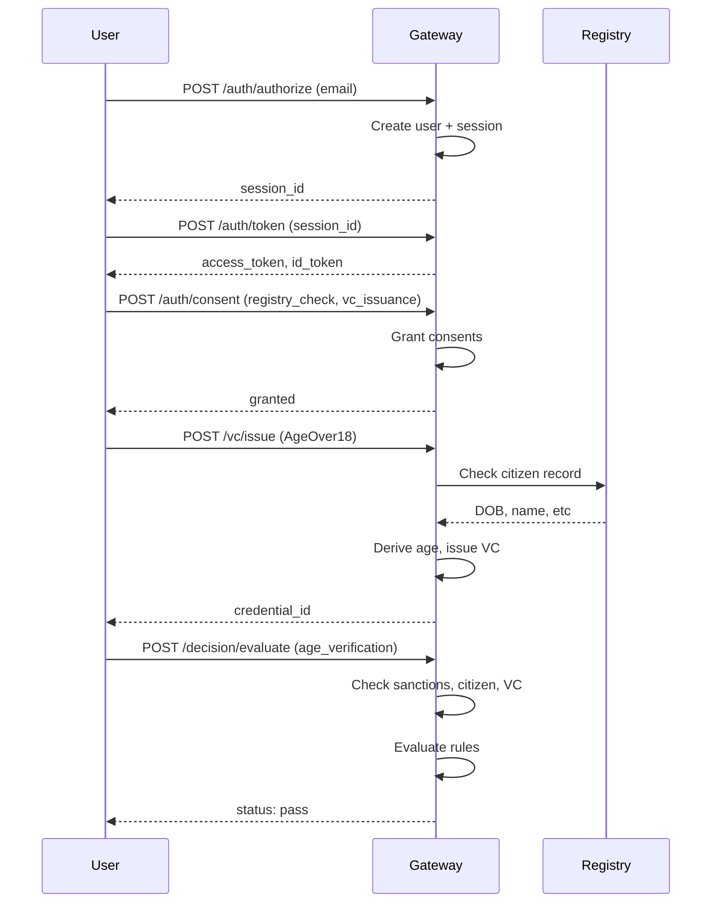

# ID Gateway Tutorial: Build a Regulated Identity Gateway

## Welcome! 🎯

This tutorial will guide you through completing the ID Gateway implementation while learning how regulated identity systems work. You'll implement OIDC authentication, consent management, verifiable credentials, and decision engines—all with privacy-first design.

---

## 0. Mental Model: What This Gateway Does

Your gateway answers one question for every request:

> **For user U, trying to do action A, for purpose P, using evidence E, is this allowed under our rules?**

This breaks down into:
- **U** (User): Managed by `internal/auth/`
- **P** (Purpose): Managed by `internal/consent/`
- **E** (Evidence): Managed by `internal/evidence/` (registries + VCs)
- **Rules**: Managed by `internal/decision/`
- **Audit trail**: Managed by `internal/audit/`

Everything you code fits into this shape.

---

## How to Use This Tutorial

Each section follows this pattern:
1. **WHAT IT IS** - Conceptual explanation
2. **WHERE IT LIVES** - Which packages in your repo
3. **WHAT'S DONE** - Already implemented code you can study
4. **YOUR TASK** - What you need to implement
5. **TESTING** - How to verify it works

Work through sections 1-9 in order. Each builds on the previous.

---

## 1. OIDC-lite: Users and Sessions

### 1.1 What OIDC Is in Practice

OpenID Connect (OIDC) is OAuth2 + identity:
- You authenticate the user
- You issue an **id token** that tells clients who they are
- You provide a **userinfo endpoint** for profile claims

Your demo doesn't need full OIDC. You just need:
- A place to store users
- Session management ("user X is logged in")
- A way to mint tokens

### 1.2 Where It Lives in Your Repo

**Package:** `internal/auth/`

**Files:**
- `models.go` - User, Session, AuthorizationRequest, TokenResult structs
- `service.go` - AuthService that wraps OIDCFlow
- `store.go` - UserStore, SessionStore interfaces
- `store_memory.go` - InMemory implementations with maps + RWMutex

**HTTP Handlers:** `internal/transport/http/handlers_auth.go`
- `POST /auth/authorize` - Start auth session
- `POST /auth/token` - Exchange session for tokens
- `GET /auth/userinfo` - Get user profile

### 1.3 What's Already Done ✅

**Study these files to understand the patterns:**

1. **Models** (`auth/models.go`):
```go
type User struct {
    ID        string
    Email     string
    FirstName string
    LastName  string
    Verified  bool
}

type Session struct {
    ID             string
    UserID         string
    RequestedScope []string
    Status         string
}
```

2. **Store Interface** (`auth/store.go`):
```go
type UserStore interface {
    SaveUser(ctx context.Context, user *User) error
    FindUserByID(ctx context.Context, id string) (*User, error)
}

type SessionStore interface {
    SaveSession(ctx context.Context, session *Session) error
    FindSessionByID(ctx context.Context, id string) (*Session, error)
}
```

3. **In-Memory Implementation** (`auth/store_memory.go`):
```go
type InMemoryUserStore struct {
    mu    sync.RWMutex
    users map[string]*User
}
```
- Thread-safe with RWMutex
- Returns typed errors
- Simple map storage

4. **Service Skeleton** (`auth/service.go`):
```go
type AuthService struct {
    flow     *OIDCFlow
    users    UserStore
    sessions SessionStore
}
```
- Delegates to OIDCFlow (currently returns "todo-*" tokens)

### 1.4 Your Task: Implement Auth Handlers

**Goal:** Wire the HTTP handlers to the AuthService.

**Open:** `internal/transport/http/handlers_auth.go`

You'll see three functions that return `notImplemented()`. Replace them with real logic.

#### Task 1A: Implement `handleAuthorize`

This handler starts an auth session.

**Expected Flow:**
1. Parse JSON request body: `{ "email": "user@example.com", "client_id": "demo-client" }`
2. Find or create user by email
3. Create a session
4. Return session ID

**Hints:**
- You'll need access to `AuthService` - add it to the `Handler` struct in `router.go`
- Use `json.NewDecoder(r.Body).Decode()` to parse input
- Create a user if `FindUserByEmail` returns not found
- Save both user and session
- Return `{ "session_id": "..." }` as JSON

**Example response:**
```json
{
  "session_id": "sess_abc123",
  "user_id": "user_xyz"
}
```

#### Task 1B: Implement `handleToken`

This handler exchanges a session ID for access/id tokens.

**Expected Flow:**
1. Parse JSON: `{ "session_id": "sess_abc123" }`
2. Validate session exists and isn't expired
3. Generate tokens (for now, use simple strings like `fmt.Sprintf("token_%s", sessionID)`)
4. Return tokens

**Example response:**
```json
{
  "access_token": "token_sess_abc123",
  "id_token": "id_sess_abc123",
  "expires_in": 3600
}
```

#### Task 1C: Implement `handleUserInfo`

This handler returns user profile given a bearer token.

**Expected Flow:**
1. Extract `Authorization: Bearer <token>` header
2. Parse token to find session (simple: extract session ID from token string)
3. Load session, then load user
4. Return user profile

**Example response:**
```json
{
  "sub": "user_xyz",
  "email": "user@example.com",
  "name": "Alice Doe"
}
```

### 1.5 Testing

**Start the server:**
```bash
make run
```

**Test authorize:**
```bash
curl -X POST http://localhost:8080/auth/authorize \
  -H "Content-Type: application/json" \
  -d '{"email": "alice@example.com", "client_id": "demo"}'
```

Expected: `{"session_id": "...", "user_id": "..."}`

**Test token:**
```bash
curl -X POST http://localhost:8080/auth/token \
  -H "Content-Type: application/json" \
  -d '{"session_id": "YOUR_SESSION_ID"}'
```

Expected: `{"access_token": "...", "id_token": "...", "expires_in": 3600}`

**Test userinfo:**
```bash
curl http://localhost:8080/auth/userinfo \
  -H "Authorization: Bearer YOUR_ACCESS_TOKEN"
```

Expected: User profile JSON

---

## 2. Consent and Purposes

### 2.1 What Consent Means Here

In regulated domains, consent is NOT just a checkbox.

Consent is:
- **Purpose-specific** - "I consent to age verification" vs "I consent to sanctions check"
- **Time-bound** - Has expiry and can be revoked
- **Auditable** - You must prove consent existed at decision time

### 2.2 Where It Lives

**Package:** `internal/consent/`

**Files:**
- `models.go` - ConsentRecord, ConsentPurpose enum
- `service.go` - Grant(), Require(), Revoke()
- `store.go` - Store interface
- `store_memory.go` - InMemory implementation

**HTTP Handler:** `internal/transport/http/handlers_consent.go`
- `POST /auth/consent` - Grant consent for purposes

### 2.3 What's Already Done ✅

**Consent Model** (`consent/models.go`):
```go
type ConsentPurpose string

const (
    ConsentPurposeLogin         ConsentPurpose = "login"
    ConsentPurposeRegistryCheck ConsentPurpose = "registry_check"
    ConsentPurposeVCIssuance    ConsentPurpose = "vc_issuance"
)

type ConsentRecord struct {
    ID        string
    UserID    string
    Purpose   ConsentPurpose
    GrantedAt time.Time
    ExpiresAt *time.Time
    RevokedAt *time.Time
}

func (c *ConsentRecord) IsActive(now time.Time) bool {
    // Checks if not revoked and not expired
}
```

**Service Methods** (`consent/service.go`):
```go
func (s *Service) Grant(ctx context.Context, userID string, purpose ConsentPurpose) error
func (s *Service) Require(ctx context.Context, userID string, purpose ConsentPurpose) error
func (s *Service) Revoke(ctx context.Context, userID string, purpose ConsentPurpose) error
```

**Store** (`consent/store_memory.go`):
- Stores consents by user ID
- Supports listing and revoking

### 2.4 Your Task: Implement Consent Handler

**Goal:** Allow users to grant consent for multiple purposes at once.

**Open:** `internal/transport/http/handlers_consent.go`

#### Task 2: Implement `handleConsent`

**Expected Flow:**
1. Extract user from bearer token (reuse pattern from handleUserInfo)
2. Parse request: `{ "purposes": ["login", "registry_check"] }`
3. For each purpose, call `consentService.Grant()`
4. Emit audit event for each grant
5. Return success

**Request body:**
```json
{
  "purposes": ["login", "registry_check", "vc_issuance"]
}
```

**Response:**
```json
{
  "granted": ["login", "registry_check", "vc_issuance"],
  "message": "Consent granted for 3 purposes"
}
```

**Hints:**
- Add `ConsentService` and `AuditPublisher` to `Handler` struct in `router.go`
- Validate purposes match ConsentPurpose enum values
- Use `auditPublisher.Emit()` to log each grant

### 2.5 How to Use Consent in Other Handlers

Before doing sensitive operations, enforce consent:

```go
// In any handler that needs consent:
err := h.consentService.Require(ctx, userID, consent.ConsentPurposeRegistryCheck)
if err != nil {
    writeError(w, err) // Maps to 403 if MissingConsent
    return
}
// Proceed with operation
```

### 2.6 Testing

**Grant consent:**
```bash
curl -X POST http://localhost:8080/auth/consent \
  -H "Authorization: Bearer YOUR_TOKEN" \
  -H "Content-Type: application/json" \
  -d '{"purposes": ["login", "registry_check"]}'
```

Expected: `{"granted": [...], "message": "..."}`

---

## 3. Registries: Citizen and Sanctions

### 3.1 What These Are

**Citizen Registry:**
- Government database of people (national ID, name, DOB, address)
- Think "population register" or "national ID database"
- Contains PII

**PEP/Sanctions Registry:**
- Lists of "Politically Exposed Persons" and sanctioned individuals
- Used for anti-money laundering (AML) and counter-terrorism financing (CTF)
- Contains risk flags

In your app, both are **mocked**, but you treat them like real external dependencies.

### 3.2 Where It Lives

**Package:** `internal/evidence/registry/`

**Files:**
- `models.go` - CitizenRecord, SanctionsRecord, MinimizeCitizenRecord()
- `service.go` - Check(), Citizen(), Sanctions() with caching
- `client_citizen.go` - MockCitizenClient
- `client_sanctions.go` - MockSanctionsClient
- `store.go` - RegistryCacheStore interface
- `store_memory.go` - TTL-aware cache (5 min expiry)

**HTTP Handlers:** `internal/transport/http/handlers_evidence.go`
- `POST /registry/citizen` - Lookup citizen record
- `POST /registry/sanctions` - Lookup sanctions record

### 3.3 What's Already Done ✅

**Models** (`registry/models.go`):
```go
type CitizenRecord struct {
    NationalID  string
    FullName    string
    DateOfBirth string  // YYYY-MM-DD
    Address     string
    Valid       bool
}

type SanctionsRecord struct {
    NationalID string
    Listed     bool
    Source     string
}
```

**Mock Clients:**
- `MockCitizenClient.Check()` - Returns deterministic data with artificial latency
- `MockSanctionsClient.Check()` - Returns configurable sanctions status

**Service with Caching** (`registry/service.go`):
```go
func (s *Service) Check(ctx context.Context, nationalID string) (*CitizenRecord, *SanctionsRecord, error)
func (s *Service) Citizen(ctx context.Context, nationalID string) (*CitizenRecord, error)
func (s *Service) Sanctions(ctx context.Context, nationalID string) (*SanctionsRecord, error)
```

**Data Minimization:**
```go
func MinimizeCitizenRecord(rec *CitizenRecord, regulatedMode bool) *CitizenRecord {
    if !regulatedMode {
        return rec
    }
    // Clear PII fields, keep only Valid flag
    return &CitizenRecord{Valid: rec.Valid}
}
```

**Cache Store:**
- TTL of 5 minutes (from `config.RegistryCacheTTL`)
- Auto-expires stale entries

### 3.4 Your Task: Implement Registry Handlers

**Goal:** Expose registry lookups via HTTP.

**Open:** `internal/transport/http/handlers_evidence.go`

#### Task 3A: Implement `handleRegistryCitizen`

**Expected Flow:**
1. Extract user from bearer token
2. Require consent for `ConsentPurposeRegistryCheck`
3. Parse request: `{ "national_id": "123456789" }`
4. Call `registryService.Citizen()`
5. Apply minimization if regulated mode
6. Emit audit event
7. Return record

**Request:**
```json
{
  "national_id": "123456789"
}
```

**Response (non-regulated):**
```json
{
  "national_id": "123456789",
  "full_name": "Alice Doe",
  "date_of_birth": "1990-05-15",
  "address": "123 Main St",
  "valid": true
}
```

**Response (regulated mode):**
```json
{
  "valid": true
}
```

#### Task 3B: Implement `handleRegistrySanctions`

**Expected Flow:**
1. Extract user from token
2. Require consent
3. Parse request: `{ "national_id": "..." }`
4. Call `registryService.Sanctions()`
5. Emit audit event
6. Return sanctions status

**Response:**
```json
{
  "national_id": "123456789",
  "listed": false,
  "source": "mock"
}
```

### 3.5 Testing

**Lookup citizen:**
```bash
curl -X POST http://localhost:8080/registry/citizen \
  -H "Authorization: Bearer YOUR_TOKEN" \
  -H "Content-Type: application/json" \
  -d '{"national_id": "123456789"}'
```

**Lookup sanctions:**
```bash
curl -X POST http://localhost:8080/registry/sanctions \
  -H "Authorization: Bearer YOUR_TOKEN" \
  -H "Content-Type: application/json" \
  -d '{"national_id": "123456789"}'
```

**Test regulated mode:**
```bash
REGULATED_MODE=true make run

# Citizen response should only contain "valid": true
```

---

## 4. Verifiable Credentials (VCs)

### 4.1 What VCs Mean

Verifiable Credentials are:
- **Signed data** that says "Issuer X attests Subject Y has claim Z"
- **Portable** - User can present them later without re-fetching data
- **Tamper-evident** - Changes invalidate the signature

For this demo, focus on the structure and lifecycle:
- Issue VC for "AgeOver18"
- Store it
- Verify it when presented
- Support revocation

### 4.2 Where It Lives

**Package:** `internal/evidence/vc/`

**Files:**
- `models.go` - VCLifecycle, IssueRequest, VerifyRequest
- `service.go` - Service wraps lifecycle + persistence
- `store.go` - Store interface
- `store_memory.go` - InMemory VC storage

**HTTP Handlers:** `internal/transport/http/handlers_evidence.go`
- `POST /vc/issue` - Issue a VC
- `POST /vc/verify` - Verify a VC

### 4.3 What's Already Done ✅

**Models** (`vc/models.go`):
```go
type IssueRequest struct {
    UserID string
    Type   string  // "AgeOver18"
    Claims map[string]any
}

type IssueResult struct {
    CredentialID string
    Issued       bool
    Reason       string
}

type VerifyRequest struct {
    CredentialID string
}

type VerifyResult struct {
    Valid  bool
    Claims map[string]any
    Reason string
}
```

**VCLifecycle** (`vc/models.go`):
```go
func (lc *VCLifecycle) Issue(ctx context.Context, req IssueRequest) IssueResult {
    // Currently returns "todo-credential-id"
}

func (lc *VCLifecycle) Verify(ctx context.Context, req VerifyRequest) VerifyResult {
    // Currently returns Valid: true
}
```

**Data Minimization:**
```go
func MinimizeClaims(claims map[string]any) map[string]any {
    // Removes PII keys: full_name, national_id, date_of_birth
}
```

### 4.4 Your Task: Implement VC Handlers

**Goal:** Allow users to issue and verify credentials.

**Open:** `internal/transport/http/handlers_evidence.go`

#### Task 4A: Implement `handleVCIssue`

**Expected Flow:**
1. Extract user from token
2. Require consent for `ConsentPurposeVCIssuance`
3. Parse request: `{ "type": "AgeOver18" }`
4. If type is "AgeOver18":
   - Fetch citizen record from registry
   - Derive `IsOver18` from DateOfBirth
   - Create claims: `{"is_over_18": true}`
5. Call `vcService.Issue()`
6. Minimize claims if regulated mode
7. Emit audit event
8. Return credential ID

**Request:**
```json
{
  "type": "AgeOver18",
  "national_id": "123456789"
}
```

**Response:**
```json
{
  "credential_id": "vc_abc123",
  "type": "AgeOver18",
  "claims": {
    "is_over_18": true
  },
  "issued_at": "2025-12-03T10:00:00Z"
}
```

**Hints:**
- Use `registryService.Citizen()` to get DOB
- Parse DOB and calculate age:
```go
dob, _ := time.Parse("2006-01-02", citizen.DateOfBirth)
age := time.Now().Year() - dob.Year()
isOver18 := age >= 18
```

#### Task 4B: Implement `handleVCVerify`

**Expected Flow:**
1. Parse request: `{ "credential_id": "vc_abc123" }`
2. Call `vcService.Verify()`
3. Return validation result

**Request:**
```json
{
  "credential_id": "vc_abc123"
}
```

**Response:**
```json
{
  "valid": true,
  "claims": {
    "is_over_18": true
  },
  "issued_at": "2025-12-03T10:00:00Z"
}
```

### 4.5 Testing

**Issue VC:**
```bash
curl -X POST http://localhost:8080/vc/issue \
  -H "Authorization: Bearer YOUR_TOKEN" \
  -H "Content-Type: application/json" \
  -d '{"type": "AgeOver18", "national_id": "123456789"}'
```

**Verify VC:**
```bash
curl -X POST http://localhost:8080/vc/verify \
  -H "Content-Type: application/json" \
  -d '{"credential_id": "vc_abc123"}'
```

---

## 5. Decision Engine

### 5.1 What Decisions Are

The decision engine is where you show **systems thinking**.

It takes:
- Purpose (what's being requested)
- User (who's requesting)
- Evidence (registry outputs, VCs)
- Context (transaction amount, country, etc.)

And returns:
- **Status:** `pass`, `pass_with_conditions`, `fail`
- **Reason:** Machine-readable string
- **Conditions:** Optional requirements (e.g., "manual_review")

### 5.2 Where It Lives

**Package:** `internal/decision/`

**Files:**
- `models.go` - DecisionInput, DecisionOutcome, DerivedIdentity
- `service.go` - Evaluate()
- `store.go` - Store interface (NO implementation yet)

**HTTP Handler:** `internal/transport/http/handlers_decision.go`
- `POST /decision/evaluate` - Evaluate a decision

### 5.3 What's Already Done ✅

**Models** (`decision/models.go`):
```go
type DecisionStatus string

const (
    DecisionPass              DecisionStatus = "pass"
    DecisionPassWithConditions DecisionStatus = "pass_with_conditions"
    DecisionFail               DecisionStatus = "fail"
)

type DecisionInput struct {
    UserID              string
    Purpose             string
    SanctionsListed     bool
    CitizenValid        bool
    HasCredential       bool
    DerivedIdentity     DerivedIdentity
}

type DecisionOutcome struct {
    Status     DecisionStatus
    Reason     string
    Conditions []string
}
```

**Service Logic** (`decision/service.go`):
```go
func (s *Service) Evaluate(ctx context.Context, in DecisionInput) (DecisionOutcome, error) {
    // Simple rules:
    if in.SanctionsListed {
        return DecisionOutcome{
            Status: DecisionFail,
            Reason: "sanctioned",
        }, nil
    }

    if !in.CitizenValid {
        return DecisionOutcome{
            Status: DecisionFail,
            Reason: "invalid_citizen",
        }, nil
    }

    if !in.DerivedIdentity.IsOver18 {
        return DecisionOutcome{
            Status: DecisionFail,
            Reason: "underage",
        }, nil
    }

    if in.HasCredential {
        return DecisionOutcome{
            Status: DecisionPass,
            Reason: "all_checks_passed",
        }, nil
    }

    return DecisionOutcome{
        Status: DecisionPassWithConditions,
        Reason: "missing_credential",
        Conditions: []string{"obtain_credential"},
    }, nil
}
```

**Derived Identity:**
```go
type DerivedIdentity struct {
    PseudonymousID string
    IsOver18       bool
}

func DerivedIdentityFromCitizen(citizen *CitizenRecord) DerivedIdentity {
    // Derives non-PII attributes from citizen data
}

func deriveIsOver18(dob string) bool {
    // Parses YYYY-MM-DD and checks if age >= 18
}
```

### 5.4 Your Task: Implement Decision Handler

**Goal:** Expose the decision engine via HTTP.

**Open:** `internal/transport/http/handlers_decision.go`

#### Task 5: Implement `handleDecisionEvaluate`

**Expected Flow:**
1. Extract user from token
2. Parse request:
```json
{
  "purpose": "age_verification",
  "context": {
    "national_id": "123456789"
  }
}
```
3. Gather evidence:
   - Fetch citizen record: `registryService.Citizen()`
   - Fetch sanctions record: `registryService.Sanctions()`
   - Check if user has "AgeOver18" VC: `vcStore.FindByUserAndType()`
4. Build `DecisionInput`
5. Call `decisionService.Evaluate()`
6. Emit audit event with decision outcome
7. Return decision

**Response:**
```json
{
  "status": "pass",
  "reason": "all_checks_passed",
  "conditions": [],
  "timestamp": "2025-12-03T10:00:00Z"
}
```

**Hints:**
- This handler orchestrates multiple services
- Map "purpose" string to required evidence types
- For "age_verification": need citizen + sanctions + VC
- For "sanctions_screening": only need sanctions check

### 5.5 Decision Rules to Implement

Add these rules to `decision/service.go`:

| Purpose | Checks | Pass Criteria |
|---------|--------|---------------|
| `age_verification` | Citizen, Sanctions, VC | Not sanctioned + valid citizen + over 18 + has VC |
| `sanctions_screening` | Sanctions | Not sanctioned |
| `high_value_transfer` | Citizen, Sanctions | Not sanctioned + valid citizen + (if sanctioned and amount > 10000: conditions) |

### 5.6 Testing

**Evaluate decision:**
```bash
curl -X POST http://localhost:8080/decision/evaluate \
  -H "Authorization: Bearer YOUR_TOKEN" \
  -H "Content-Type: application/json" \
  -d '{
    "purpose": "age_verification",
    "context": {
      "national_id": "123456789"
    }
  }'
```

**Expected responses:**
- `{"status": "pass", "reason": "all_checks_passed"}` - All evidence present
- `{"status": "fail", "reason": "sanctioned"}` - User is sanctioned
- `{"status": "fail", "reason": "underage"}` - User is under 18
- `{"status": "pass_with_conditions", "reason": "missing_credential", "conditions": ["obtain_credential"]}` - Missing VC

---

## 6. Audit Log and Event Queue

### 6.1 What Audit Means

In regulated domains, audit is about answering:
> Who did what, to whose data, when, for what purpose, and with what decision?

Key principles:
- **Append-only** - Never modify or delete events
- **Complete** - Log all sensitive operations
- **Searchable** - Query by user, action, purpose
- **Non-blocking** - Main flows shouldn't wait for audit writes

### 6.2 Where It Lives

**Package:** `internal/audit/`

**Files:**
- `models.go` - AuditEvent struct
- `publisher.go` - Emit(), List()
- `worker.go` - Background consumer goroutine
- `store.go` - Store interface
- `store_memory.go` - InMemory append-only store

### 6.3 What's Already Done ✅

**Event Model** (`audit/models.go`):
```go
type Event struct {
    ID        string
    Timestamp time.Time
    UserID    string
    Action    string
    Purpose   string
    Decision  string
    Reason    string
    RequestID string
}
```

**Publisher** (`audit/publisher.go`):
```go
func (p *Publisher) Emit(ctx context.Context, ev Event) error {
    // Publishes to store
}

func (p *Publisher) List(ctx context.Context, userID string) ([]Event, error) {
    // Lists events for a user
}
```

**Worker** (`audit/worker.go`):
```go
func (w *Worker) Run(ctx context.Context) {
    // Background loop that could process events from a queue
}
```

**Store** (`audit/store_memory.go`):
```go
type InMemoryStore struct {
    mu     sync.RWMutex
    events map[string][]Event  // Keyed by user ID
}

func (s *InMemoryStore) Append(ctx context.Context, ev Event) error
func (s *InMemoryStore) ListByUser(ctx context.Context, userID string) ([]Event, error)
```

### 6.4 Your Task: Wire Audit Throughout

**Goal:** Emit audit events in all handlers.

#### Task 6A: Add Audit to All Handlers

For each handler you've implemented, add audit logging:

**Example in handleAuthorize:**
```go
// After successfully creating session:
_ = h.auditPublisher.Emit(ctx, audit.Event{
    ID:        uuid.New().String(),
    Timestamp: time.Now(),
    UserID:    user.ID,
    Action:    "auth_started",
    Purpose:   "login",
    RequestID: r.Header.Get("X-Request-ID"),
})
```

**Events to emit:**

| Handler | Action | When |
|---------|--------|------|
| handleAuthorize | `auth_started` | Session created |
| handleToken | `token_issued` | Tokens generated |
| handleConsent | `consent_granted` | Each purpose granted |
| handleRegistryCitizen | `registry_citizen_checked` | Record fetched |
| handleRegistrySanctions | `registry_sanctions_checked` | Record fetched |
| handleVCIssue | `vc_issued` | Credential created |
| handleVCVerify | `vc_verified` | Credential validated |
| handleDecisionEvaluate | `decision_made` | Decision returned |

#### Task 6B: Implement `/me/data-export` Handler

**Goal:** Allow users to export all their audit logs.

**Open:** `internal/transport/http/handlers_me.go`

**Expected Flow:**
1. Extract user from token
2. Call `auditPublisher.List(userID)`
3. Return all events as JSON

**Response:**
```json
{
  "user_id": "user_xyz",
  "events": [
    {
      "id": "evt_123",
      "timestamp": "2025-12-03T10:00:00Z",
      "action": "auth_started",
      "purpose": "login"
    },
    {
      "id": "evt_124",
      "timestamp": "2025-12-03T10:01:00Z",
      "action": "consent_granted",
      "purpose": "registry_check"
    }
  ]
}
```

### 6.5 Testing

**Export audit log:**
```bash
curl http://localhost:8080/me/data-export \
  -H "Authorization: Bearer YOUR_TOKEN"
```

**Verify all actions are logged:**
- Perform a full flow: authorize → consent → issue VC → evaluate decision
- Export audit log
- Confirm all 4+ events appear

---

## 7. Data Deletion (Right to be Forgotten)

### 7.1 GDPR Right to Erasure

Under GDPR, users can request deletion of their personal data.

**Challenges:**
- Audit logs must be retained (legal requirement)
- Some data (consents) must be kept for compliance
- Pseudonymization vs deletion

**Your approach:**
- Delete user profile and sessions
- Pseudonymize audit logs (replace email with hashed ID)
- Delete VCs
- Clear registry cache

### 7.2 Your Task: Implement Data Deletion

**Open:** `internal/transport/http/handlers_me.go`

#### Task 7: Implement `handleDataDeletion`

**Expected Flow:**
1. Extract user from token
2. Emit audit event: `data_deletion_requested`
3. Delete from each store:
   - Delete user: `userStore.DeleteUser(userID)`
   - Delete sessions: `sessionStore.DeleteByUser(userID)`
   - Revoke all consents: `consentStore.RevokeAll(userID)`
   - Delete VCs: `vcStore.DeleteByUser(userID)`
   - Clear registry cache: `registryCacheStore.ClearUser(userID)`
4. **Keep audit logs** (pseudonymize if needed)
5. Return confirmation

**Response:**
```json
{
  "message": "All personal data deleted",
  "retained": ["audit_logs"],
  "deleted_at": "2025-12-03T10:00:00Z"
}
```

**Hints:**
- You'll need to add `DeleteUser()`, `DeleteByUser()`, etc. methods to store interfaces
- Audit logs should stay but you could hash email → pseudonymous ID
- Return HTTP 204 No Content on success

### 7.3 Testing

**Delete all data:**
```bash
curl -X DELETE http://localhost:8080/me \
  -H "Authorization: Bearer YOUR_TOKEN"
```

**Verify deletion:**
```bash
# This should fail with 401/404:
curl http://localhost:8080/auth/userinfo \
  -H "Authorization: Bearer YOUR_TOKEN"
```

---

## 8. Putting It All Together: Complete Flow

### 8.1 The Happy Path

Let's walk through a complete regulated identity verification flow:



### 8.2 Integration Test

Create `test/integration_test.go`:

```go
func TestCompleteFlow(t *testing.T) {
    // 1. Start server
    // 2. Authorize
    // 3. Get token
    // 4. Grant consent
    // 5. Issue VC
    // 6. Evaluate decision
    // 7. Export audit log
    // 8. Verify all events logged
}
```

### 8.3 Regulated Mode Verification

Test data minimization:

```bash
# Start in regulated mode
REGULATED_MODE=true make run

# Issue VC - should only see derived attributes
curl -X POST http://localhost:8080/vc/issue \
  -H "Authorization: Bearer YOUR_TOKEN" \
  -d '{"type": "AgeOver18", "national_id": "123456789"}'

# Response should NOT contain full_name, date_of_birth in claims
```

---

## 9. Advanced Scenarios

### 9.1 Adding a New Purpose

**Scenario:** You want to add `crypto_withdrawal` purpose.

**Checklist:**
1. Add to `ConsentPurpose` enum in `consent/models.go`
2. Define decision rules in `decision/service.go`:
   - Require: citizen valid + not sanctioned + amount < 10000
3. Update relevant handlers to accept new purpose
4. Add tests

### 9.2 High-Risk Transaction Flow

**Scenario:** Transactions over €10,000 require manual review if user is PEP.

**Implementation:**
```go
// In decision/service.go
if in.Purpose == "high_value_transfer" {
    amount := in.Context["amount"].(float64)
    if in.SanctionsListed {
        return DecisionFail, "sanctioned"
    }
    if in.IsPEP && amount > 10000 {
        return DecisionPassWithConditions, "manual_review_required"
    }
    return DecisionPass, "approved"
}
```

### 9.3 Adding Real Crypto Signatures to VCs

**Future enhancement:** Replace mock VCs with real signatures.

**Steps:**
1. Install library: `go get github.com/lestrrat-go/jwx/v2`
2. Generate signing key in `cmd/server/main.go`
3. Update `vc.VCLifecycle.Issue()` to sign claims
4. Update `vc.VCLifecycle.Verify()` to validate signature

---

## 10. Production Readiness Checklist

### 10.1 Replace In-Memory Stores with Postgres

**Files to change:**
- Add `internal/auth/store_postgres.go`
- Add `internal/consent/store_postgres.go`
- Add connection pooling in `cmd/server/main.go`

### 10.2 Replace Channel with NATS/Kafka for Audit

**Why:** In-memory channel doesn't survive restarts.

**Steps:**
1. Add NATS client
2. Update `audit.Publisher.Emit()` to publish to NATS
3. Update `audit.Worker.Run()` to subscribe to NATS
4. Store events in Postgres

### 10.3 Add Real OIDC Provider

Replace `auth.OIDCFlow` with a library like `github.com/ory/fosite`.

### 10.4 Add API Authentication

Add middleware to validate bearer tokens:
```go
func authMiddleware(next http.Handler) http.Handler {
    return http.HandlerFunc(func(w http.ResponseWriter, r *http.Request) {
        token := extractBearerToken(r)
        user, err := validateToken(token)
        if err != nil {
            http.Error(w, "Unauthorized", 401)
            return
        }
        ctx := context.WithValue(r.Context(), "user", user)
        next.ServeHTTP(w, r.WithContext(ctx))
    })
}
```

---

## Appendix: Architecture Patterns

### A1. Package Organization

```
internal/
├── platform/       # Cross-cutting (config, logger, HTTP server)
├── auth/           # User & session domain
├── consent/        # Consent lifecycle domain
├── evidence/       # Evidence gathering (registry, VC)
│   ├── registry/   # External registry integration
│   └── vc/         # Verifiable credentials
├── decision/       # Decision engine domain
├── audit/          # Audit logging domain
└── transport/      # HTTP handlers
    └── http/
```

**Pattern:** Each domain is a mini-microservice with:
- `models.go` - Pure domain types
- `service.go` - Business logic
- `store.go` - Persistence interface
- `store_memory.go` - In-memory implementation

### A2. Error Handling Pattern

All errors use typed error codes:
```go
import "id-gateway/pkg/errors"

return errors.NewGatewayError(errors.CodeMissingConsent, "consent not granted for purpose: registry_check", nil)
```

HTTP handler maps errors:
```go
func writeError(w http.ResponseWriter, err error) {
    if gwErr, ok := err.(*errors.GatewayError); ok {
        status := errors.ToHTTPStatus(gwErr.Code)
        http.Error(w, gwErr.Message, status)
    } else {
        http.Error(w, "Internal server error", 500)
    }
}
```

### A3. Regulated Mode Pattern

Pass `regulatedMode bool` through layers:
```go
// In handler:
citizen, _ := h.registryService.Citizen(ctx, nationalID)
if h.regulatedMode {
    citizen = registry.MinimizeCitizenRecord(citizen, true)
}
```

### A4. Consent Enforcement Pattern

Before any sensitive operation:
```go
err := h.consentService.Require(ctx, userID, consent.ConsentPurposeRegistryCheck)
if err != nil {
    writeError(w, err)
    return
}
// Proceed with operation
```

### A5. Audit Logging Pattern

After every operation:
```go
_ = h.auditPublisher.Emit(ctx, audit.Event{
    ID:        uuid.New().String(),
    Timestamp: time.Now(),
    UserID:    userID,
    Action:    "vc_issued",
    Purpose:   string(consent.ConsentPurposeVCIssuance),
    Decision:  "granted",
    Reason:    "age_over_18",
})
```

---

## Summary: Your Learning Path

1. ✅ **Understand the architecture** - Study the existing models and interfaces
2. ⚠️ **Implement auth handlers** - Wire up user sessions and tokens
3. ⚠️ **Add consent flow** - Enable purpose-based consent grants
4. ⚠️ **Wire registry lookups** - Expose citizen/sanctions checks
5. ⚠️ **Build VC issuance** - Create age verification credentials
6. ⚠️ **Complete decision engine** - Orchestrate evidence gathering and evaluation
7. ⚠️ **Add audit logging** - Emit events throughout
8. ⚠️ **Enable data export/deletion** - GDPR compliance
9. 🎯 **Test complete flow** - Run integration tests
10. 🚀 **Explore production readiness** - Review `docs/productionization.md`

---

## Getting Help

- **Architecture questions:** Read `docs/architecture.md` and `docs/structure.md`
- **Implementation patterns:** Study existing `store_memory.go` files
- **Testing:** Use `make test` and check `test/scaffold_test.go`
- **Code examples:** Look at `consent/` and `audit/` for complete implementations

Good luck building your regulated identity gateway! 🎉
