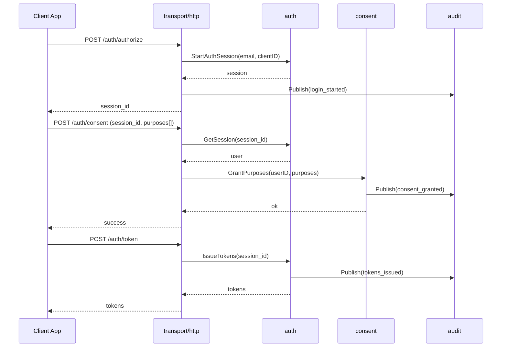
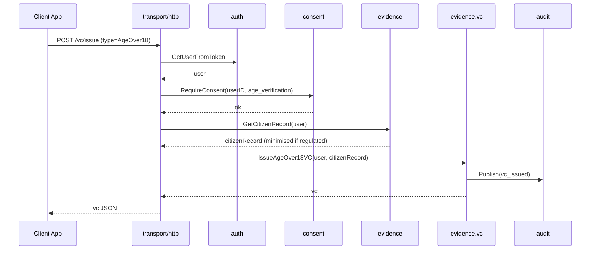
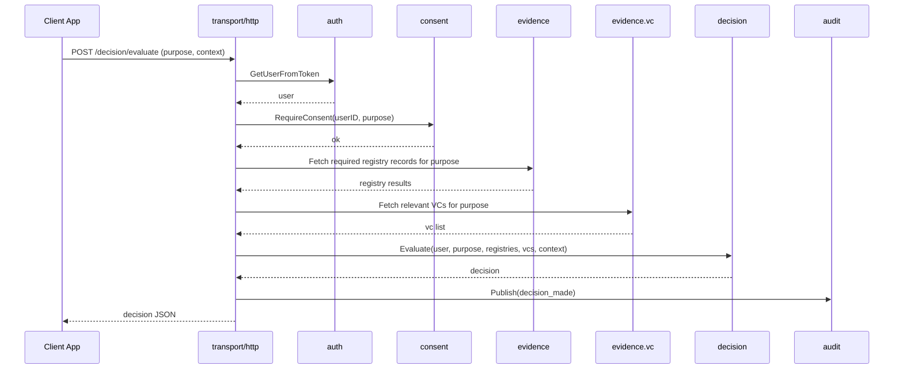
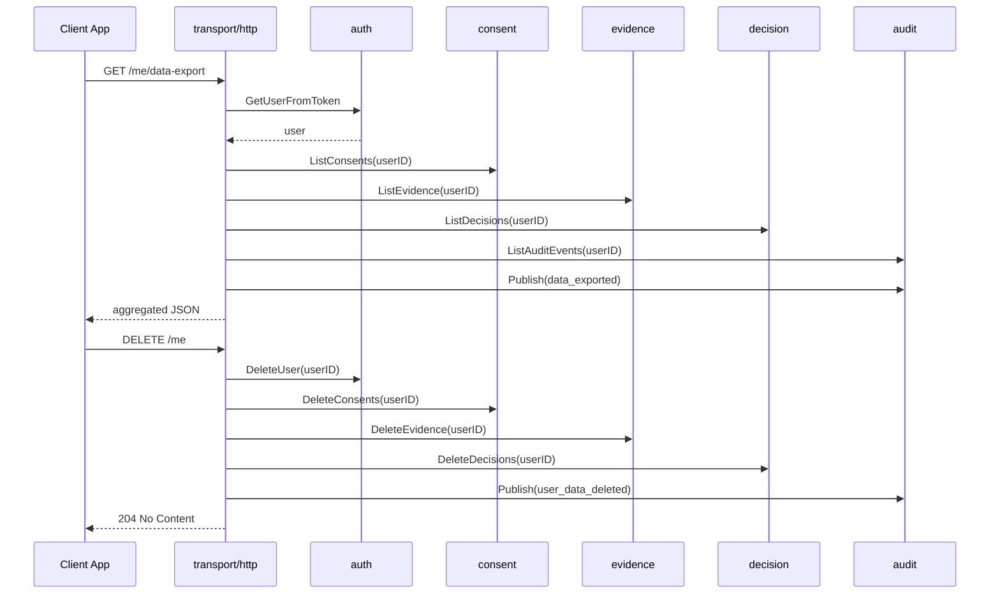

# Identity Verification Gateway - Architecture Documentation

This document describes the architecture of the Identity Verification Gateway: a Go service that simulates regulated identity verification flows, consent, registry checks, and verifiable credentials.

The runtime is a single process (modular monolith), but internal packages are structured along clear service boundaries so that it could be split into microservices later.

## Table of Contents

* [High Level Architecture](#high-level-architecture)
* [Service Boundaries inside the Monolith](#service-boundaries-inside-the-monolith)
* [Package Layout](#package-layout)
* [User Scenarios](#user-scenarios)
* [Component Breakdown](#component-breakdown)

  * [Auth](#auth)
  * [Consent](#consent)
  * [Evidence](#evidence)
  * [Decision](#decision)
  * [Audit](#audit)
  * [Transport HTTP](#transport-http)
  * [Platform](#platform)
* [Core Flows](#core-flows)

  * [Login and Consent](#login-and-consent)
  * [Verification and VC Issuance](#verification-and-vc-issuance)
  * [Decision Evaluation](#decision-evaluation)
  * [Data Export and Deletion](#data-export-and-deletion)
* [Data Model Overview](#data-model-overview)
* [Regulated Mode Behaviour](#regulated-mode-behaviour)
* [Productionisation Considerations](#productionisation-considerations)
* [Design Rationale](#design-rationale)

---

## High Level Architecture

```text
                 ┌────────────────────────────┐
                 │       Client Apps          │
                 │  Demo UI or partner apps   │
                 └─────────────┬──────────────┘
                               │ HTTP
                               ▼
                 ┌────────────────────────────┐
                 │      transport/http        │
                 │    routing and handlers    │
                 └─────────────┬──────────────┘
                               │ calls into services
                               ▼
      ┌─────────────── internal (same process) ─────────────────┐
      │                                                         │
      │  ┌─────────┐  ┌───────────┐  ┌───────────┐  ┌────────┐ │
      │  │  auth   │  │  consent  │  │ evidence  │  │decision│ │
      │  │ users   │  │ purposes  │  │ registry  │  │ engine │ │
      │  │ sessions│  │ lifecycle │  │ vc        │  │ rules  │ │
      │  └────┬────┘  └─────┬─────┘  └─────┬─────┘  └────┬───┘ │
      │       │             │               │             │     │
      │       └──────────┬──┴───────────────┴─────────────┘     │
      │                  ▼                                      │
      │               ┌───────┐                                 │
      │               │ audit │                                 │
      │               │ queue │                                 │
      │               └──┬────┘                                 │
      │                  ▼                                      │
      │              storage layer                              │
      └─────────────────────────────────────────────────────────┘

                       ▼
                Observability, logs
```

Everything runs in one binary, but each internal package has a clear responsibility and limited dependencies.

---

## Service Boundaries inside the Monolith

If this system were split into microservices, reasonable boundaries would be:

1. **Auth Service**
   Users and sessions, OIDC lite login, tokens, userinfo.

2. **Consent and Policy Service**
   Purpose based consent, consent lifecycle, policy rules.

3. **Evidence Service**
   Registry checks (citizen, PEP sanctions), verifiable credential issuance and verification.

4. **Decision Service**
   Decision engine that combines evidence, purpose, and context.

5. **Audit Service**
   Append only audit log, queue consumer, durable audit storage.

In the monolith, each of these is a package with a narrow API. The process is single, the boundaries are logical.

---

## Package Layout

Suggested layout aligned with those boundaries:

```text
internal/
  platform/
    config/         # configuration loading
    logger/         # logging abstraction
    httpserver/     # shared HTTP server setup
  auth/
    service.go      # Users, sessions, tokens
    store.go        # UserStore, SessionStore
    models.go
  consent/
    service.go      # Grant, revoke, RequireConsent
    store.go
    models.go
  evidence/
    registry/
      client_citizen.go    # citizen registry mock
      client_sanctions.go  # sanctions registry mock
      service.go           # RegistryService, caching, minimisation
      store.go             # RegistryCacheStore
      models.go
    vc/
      service.go           # VCService
      store.go             # VCStore
      models.go
  decision/
    service.go      # Evaluate decisions
    store.go        # DecisionStore
    models.go
  audit/
    publisher.go    # queue or channel publisher
    worker.go       # background consumer
    store.go        # AuditStore
    models.go
  transport/
    http/
      router.go
      handlers_auth.go
      handlers_consent.go
      handlers_evidence.go
      handlers_decision.go
      handlers_me.go
cmd/
  server/
    main.go         # wires everything together
```

Rules of thumb:

* `transport/http` depends on services only, not on storage details.
* Services depend on their own stores and on other services through interfaces, not on handlers.
* `audit` is a shared dependency all services can call to emit events.
* `platform` provides cross cutting plumbing such as config and logging.

---

## User Scenarios

The main user scenarios are unchanged, but thinking in terms of the new boundaries helps.

### Scenario 1 - Fintech age verification for onboarding

* Auth service logs the user in and issues tokens.
* Consent service records consent for `age_verification`.
* Evidence service calls citizen registry, derives `is_over_18`, issues an `AgeOver18` VC.
* Decision service uses registry evidence and VC to return `pass`.
* Audit service records login, consent, registry query, VC issuance, and decision.

### Scenario 2 - Sanctions check for high risk operation

* Auth service identifies current user via access token.
* Consent service verifies consent for `sanctions_screening`.
* Evidence service calls sanctions registry and returns `IsPep`, `IsSanctioned`.
* Decision service returns `fail` or `pass_with_conditions` based on policy.
* Audit service records the decision with reason.

### Scenario 3 - Data export and deletion for user rights

* Auth service identifies user.
* Consent, evidence, decision, and audit services expose read methods via their stores to gather all data for the user.
* Transport layer exposes `/me/data-export` and `/me` on top of these services.
* Audit service records `data_exported` and `user_data_deleted` events.

---

## Component Breakdown

### Auth

**Responsibilities**

* Manage `User` and `Session` objects.
* Implement minimal OIDC like behaviour: authorize, token, userinfo.
* Provide a helper to resolve the current user from an access token for other services.

**Key types**

```go
type User struct {
    ID        string
    Email     string
    FirstName string
    LastName  string
    Verified  bool
}

type Session struct {
    ID             string
    UserID         string
    RequestedScope []string
    Status         string // "pending_consent", "active", "expired"
}
```

**Clients**

* Called by `transport/http` for login and token endpoints.
* Called by `transport/http` to resolve current user for any authenticated endpoints.

---

### Consent

**Responsibilities**

* Model purpose based consent as first class data.
* Enforce consent requirements before sensitive operations.
* Provide a stable enforcement API used by other services.

**Key types**

```go
type ConsentPurpose string

const (
    ConsentPurposeLogin         ConsentPurpose = "login"
    ConsentPurposeRegistryCheck ConsentPurpose = "registry_check"
    ConsentPurposeVCIssuance    ConsentPurpose = "vc_issuance"
    ConsentPurposeDecision      ConsentPurpose = "decision_evaluation"
)

type ConsentRecord struct {
    ID        string
    UserID    string
    Purpose   ConsentPurpose
    GrantedAt time.Time
    ExpiresAt *time.Time
    RevokedAt *time.Time
}
```

**Services**

* `GrantPurposes(userID, purposes)`
* `RequireConsent(userID, purpose)` returns typed errors `ErrMissingConsent`, `ErrConsentExpired`.

**Clients**

* Called by `transport/http` on `/auth/consent`.
* Called by `evidence` and `decision` services to enforce requirements.

---

### Evidence

Evidence is split into `registry` and `vc`.

#### Registry

**Responsibilities**

* Integrate with citizen and sanctions registry mocks.
* Cache results with TTL.
* Apply minimisation when regulated mode is active.

**Key types**

```go
type CitizenRecord struct {
    NationalID  string    // Unique national identifier
    FullName    string    // Full legal name
    DateOfBirth string    // Format: YYYY-MM-DD
    Address     string    // Full address
    Valid       bool      // Whether record is valid/active
    CheckedAt   time.Time // When this record was fetched
}

type SanctionsRecord struct {
    NationalID string    // Unique national identifier
    Listed     bool      // Whether person is on sanctions/PEP list
    Source     string    // Source of the flag
    CheckedAt  time.Time // When this record was fetched
}
```

**Service**

* `Check(ctx, nationalID)` - Returns both citizen and sanctions records
* `Citizen(ctx, nationalID)` - Returns citizen record from cache or registry
* `Sanctions(ctx, nationalID)` - Returns sanctions record from cache or registry

This service is the only place that knows about external registry details. It handles caching with a 5-minute TTL and applies data minimization in regulated mode using `MinimizeCitizenRecord()`.

#### VC

**Responsibilities**

* Issue and verify simple verifiable credentials such as `AgeOver18`.
* Store and revoke credentials.

**Key types**

```go
type VerifiableCredential struct {
    ID       string
    UserID   string
    Type     string
    Issuer   string
    IssuedAt time.Time
    Claims   map[string]any
    Revoked  bool
}
```

**Service**

* `Issue(ctx, IssueRequest)` - Issues a verifiable credential based on type and claims
* `Verify(ctx, credentialID)` - Verifies a credential exists and is not revoked

The service supports claim minimization in regulated mode using `MinimizeClaims()` which removes PII keys like full_name, national_id, and date_of_birth.

---

### Decision

**Responsibilities**

* Combine purpose, user, evidence, and context into a decision.
* Encapsulate business rules for `age_verification`, `sanctions_screening`, and any other purposes.

**Key types**

```go
type DecisionStatus string

const (
    DecisionPass              DecisionStatus = "pass"
    DecisionPassWithConditions               = "pass_with_conditions"
    DecisionFail                             = "fail"
)

type DecisionInput struct {
    UserID          string
    Purpose         string
    SanctionsListed bool
    CitizenValid    bool
    HasCredential   bool
    DerivedIdentity DerivedIdentity
    Context         map[string]any // Extra data (amount, country, etc.)
}

type DerivedIdentity struct {
    PseudonymousID string // Hash of user ID for privacy
    IsOver18       bool   // Derived from DateOfBirth, no PII
}

type DecisionOutcome struct {
    Status     DecisionStatus
    Reason     string
    Conditions []string // e.g., ["obtain_credential", "manual_review"]
}
```

**Service**

* `Evaluate(ctx, DecisionInput) (DecisionOutcome, error)`

The `DecisionInput` structure contains pre-processed evidence (sanctions status, citizen validity, credential existence) and derived identity attributes. This ensures no PII is passed to the decision engine - only boolean flags and computed values.

---

### Audit

**Responsibilities**

* Provide a simple API for other services to publish audit events.
* Decouple publishing from persistence using a queue or Go channel.
* Persist events in an `AuditStore` and log them.

**Key types**

```go
type Event struct {
    ID        string    // Unique event ID
    Timestamp time.Time // When event occurred
    UserID    string    // Subject user ID (combines ActorID/SubjectID)
    Action    string    // What happened (e.g., "consent_granted")
    Purpose   string    // Why (e.g., "registry_check")
    Decision  string    // Outcome (e.g., "granted", "pass", "fail")
    Reason    string    // Human-readable reason
    RequestID string    // Correlation ID for tracing
}
```

**Components**

* `AuditPublisher` interface for publishing events.
* Channel based implementation for the prototype.
* Worker that drains the channel and writes to `AuditStore`.

**Clients**

* Called by auth, consent, evidence, decision, and transport layers when key actions occur.

---

### Transport HTTP

**Responsibilities**

* Expose REST endpoints.
* Marshal and unmarshal JSON.
* Handle errors and HTTP status codes.
* Call into services only, no business rules.

Key handlers grouped by file, for example:

* `handlers_auth.go` for `/auth/*` endpoints.
* `handlers_consent.go` for `/auth/consent`.
* `handlers_evidence.go` for `/vc/*` or registry endpoints if you expose them.
* `handlers_decision.go` for `/decision/evaluate`.
* `handlers_me.go` for `/me/data-export` and `/me`.

---

### Platform

**Responsibilities**

* Cross cutting concerns, not domain logic.

Typical contents:

* Config loading (environment variables, flags).
* Logger initialisation.
* HTTP server startup and graceful shutdown.

---

## Core Flows

The flows are similar to the earlier version, but now you can see clearly which internal services are involved.

### Login and Consent



---

### Verification and VC Issuance



---

### Decision Evaluation



---

### Data Export and Deletion



---

## Data Model Overview

High level entities across services:

* `auth`
  * `User` - ID, Email, FirstName, LastName, Verified
  * `Session` - ID, UserID, RequestedScope, Status

* `consent`
  * `ConsentPurpose` - Enum: login, registry_check, vc_issuance, decision_evaluation
  * `ConsentRecord` - ID, UserID, Purpose, GrantedAt, ExpiresAt, RevokedAt

* `evidence.registry`
  * `CitizenRecord` - NationalID, FullName, DateOfBirth (string), Address, Valid, CheckedAt
  * `SanctionsRecord` - NationalID, Listed, Source, CheckedAt
  * Cached in `RegistryCacheStore` with 5-minute TTL

* `evidence.vc`
  * `VerifiableCredential` - ID, Type, Subject, Issuer, IssuedAt, Claims (map), Revoked
  * `IssueRequest` / `IssueResult` - Request/response structures
  * `VerifyRequest` / `VerifyResult` - Verification structures

* `decision`
  * `DecisionInput` - UserID, Purpose, SanctionsListed, CitizenValid, HasCredential, DerivedIdentity, Context
  * `DerivedIdentity` - PseudonymousID, IsOver18 (no PII)
  * `DecisionOutcome` - Status, Reason, Conditions

* `audit`
  * `Event` - ID, Timestamp, UserID, Action, Purpose, Decision, Reason, RequestID

**Relationships:**
- All entities linked by `UserID`
- Purpose strings from `ConsentPurpose` enum
- DerivedIdentity computed from CitizenRecord without storing PII
- Audit events reference all operations but store no raw PII

---

## Regulated Mode Behaviour

`REGULATED_MODE=true` affects behaviour across services to enforce GDPR data minimization principles:

* `auth`
  Standard user and session management. May enforce stricter session duration in production.

* `consent`
  Mandatory for registry, VC, and decision flows. Missing consent returns HTTP 403 with typed error `CodeMissingConsent`.

* `evidence.registry`
  **Key minimization logic:**
  - Calls `MinimizeCitizenRecord()` before returning data
  - In regulated mode: strips `FullName`, `DateOfBirth`, `Address` - keeps only `Valid` boolean and `NationalID`
  - Derives `IsOver18` from `DateOfBirth` in decision logic, then discards raw DOB
  - Cache TTL enforced at 5 minutes (from `config.RegistryCacheTTL`)
  - Sanctions records are not minimized (contain no PII, only boolean `Listed` flag)

* `evidence.vc`
  **Key minimization logic:**
  - Calls `MinimizeClaims()` before storing credentials
  - In regulated mode: removes keys `full_name`, `national_id`, `date_of_birth`, `verified_via`
  - Keeps only derived attributes (e.g., `is_over_18: true`)
  - Issues credentials with minimal claims, not raw identity data

* `decision`
  **Privacy-first design:**
  - Accepts `DerivedIdentity` struct with `IsOver18` boolean, not raw DOB
  - Decision logic operates on pre-computed flags (`SanctionsListed`, `CitizenValid`, `HasCredential`)
  - No PII flows through decision engine, only boolean evidence

* `audit`
  Required for all sensitive operations. Events include action, purpose, decision, reason but avoid logging raw PII (use user IDs, not emails).

Having the code structured by services makes these toggles easier to reason about. The pattern is: **derive → decide → discard PII**.

---

## Productionisation Considerations

### Current State (MVP)
**What's Implemented:**
- ✅ Complete domain models and service layer logic
- ✅ In-memory stores (UserStore, SessionStore, ConsentStore, VCStore, RegistryCacheStore, AuditStore)
- ✅ Storage interfaces abstracted (ready for Postgres implementations)
- ✅ Data minimization functions (MinimizeCitizenRecord, MinimizeClaims)
- ✅ Consent enforcement with typed errors
- ✅ Registry caching with TTL
- ✅ Derived identity pattern (PII-free decision making)
- ✅ HTTP routing and error mapping
- ✅ Config loading from environment
- ✅ Basic audit event models

**What's Stubbed (501 Handlers):**
- ⚠️ All HTTP handler implementations (11 endpoints)
- ⚠️ Real token generation (currently returns "todo-access", "todo-id")
- ⚠️ Real VC credential ID generation
- ⚠️ Async audit worker (worker.go exists but not wired)

### Production Roadmap
Key improvements to harden this design:

1. **Persistent Storage**
   - Replace in-memory stores with Postgres repositories per service
   - Add connection pooling and retry logic
   - Implement proper transaction handling for multi-store operations

2. **Audit System**
   - Replace synchronous audit with buffered channel + background worker
   - Deploy worker as separate goroutine or process
   - Consider NATS/Kafka for audit event streaming
   - Add audit log encryption and signing for tamper-proofing

3. **Authentication**
   - Replace OIDC-lite with real OIDC provider (e.g., Ory Fosite, Keycloak)
   - Implement JWT signing with RS256/ES256
   - Add refresh token support
   - Implement token revocation list

4. **Observability**
   - Add structured logging (zerolog, zap)
   - Add metrics (Prometheus) around service boundaries
   - Add distributed tracing (OpenTelemetry)
   - Add health check endpoints

5. **Policy Engine**
   - Externalize decision rules to JSON/YAML configuration
   - Support dynamic rule updates without redeployment
   - Add A/B testing framework for rule variations

6. **Security Hardening**
   - Add rate limiting per user/IP
   - Implement circuit breakers for registry calls
   - Add request signing/verification
   - Implement API key management
   - Add CORS configuration

7. **Microservices Split**
   The boundaries already match likely service splits:
   - `auth` service (users, sessions, tokens)
   - `consent` service (consent lifecycle)
   - `evidence` service (registry + VC)
   - `decision` service (rule evaluation)
   - `audit` service (event streaming and storage)

   Each can be deployed independently with its own database and scaling policy.

---

## Design Rationale

### Why a Modular Monolith?
* **Avoid premature distribution:** The monolith avoids early distributed systems complexity (network latency, partial failures, consistency challenges) while still modelling realistic identity flows.
* **Clear boundaries:** Internal packages map to clear business responsibilities with well-defined service interfaces, making the code easy to explain and reason about.
* **Production-ready pattern:** The separation of auth, consent, evidence, decision, and audit reflects how regulated environments are actually structured in practice, even when everything runs on one platform.
* **Easy to split later:** Service boundaries are designed to support microservices extraction if needed - each package has its own store interface and minimal cross-dependencies.

### Why Interface-Based Storage?
* **Testability:** Service logic can be tested with mock stores without spinning up databases.
* **Flexibility:** Easy to swap in-memory stores for Postgres, MongoDB, or cloud-native storage.
* **Clear contracts:** Store interfaces document exactly what persistence operations each service needs.

### Why Derived Identity Pattern?
* **GDPR compliance:** Computing `IsOver18` from `DateOfBirth` then discarding the raw DOB satisfies data minimization requirements.
* **Privacy by design:** Decision engine operates on boolean flags, not PII - prevents accidental logging or exposure.
* **Audit-friendly:** Decisions based on derived attributes can be logged without violating privacy.

### Why Purpose-Based Consent?
* **Regulatory requirement:** GDPR Article 7 requires consent to be "specific" - blanket consent is not valid.
* **User control:** Users can grant consent for age verification while denying consent for marketing.
* **Enforcement:** The `Require()` pattern forces handlers to explicitly check consent before data processing.

### Why Separate Evidence Domain?
* **Separation of concerns:** Registry integration (external systems, caching, errors) is isolated from decision logic.
* **Testability:** Decision engine can be tested with mock evidence without caring about registry implementation.
* **Flexibility:** Easy to add new evidence sources (credit checks, KYC providers) without touching decision logic.

### Current Implementation Status
The codebase currently has:
- ✅ **Strong foundation:** All domain models, service interfaces, and storage abstractions are complete and follow best practices.
- ✅ **Testable architecture:** In-memory stores and service layer are fully functional, allowing unit testing without external dependencies.
- ⚠️ **HTTP layer incomplete:** Handlers are scaffolded (routes defined) but return 501 - implementation required (see PRDs in `docs/prd/`).

This design makes it straightforward to complete the implementation by following the PRDs, which provide step-by-step instructions for wiring the HTTP handlers to the existing service layer.