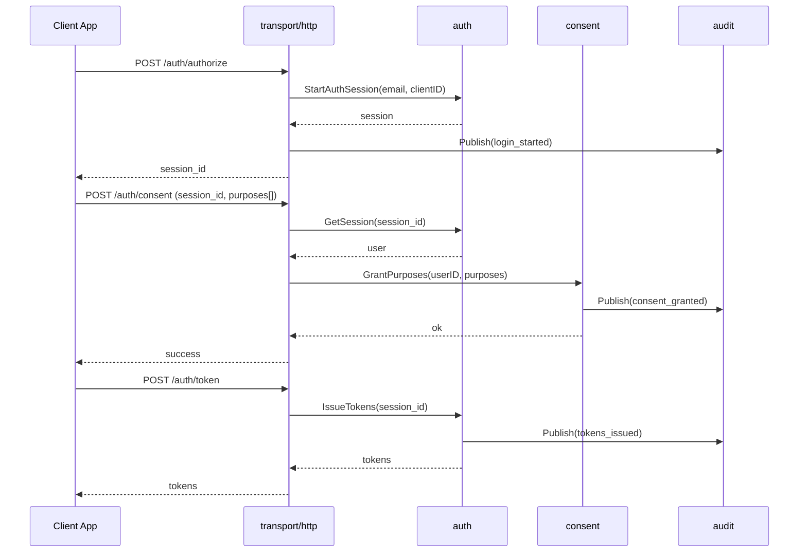
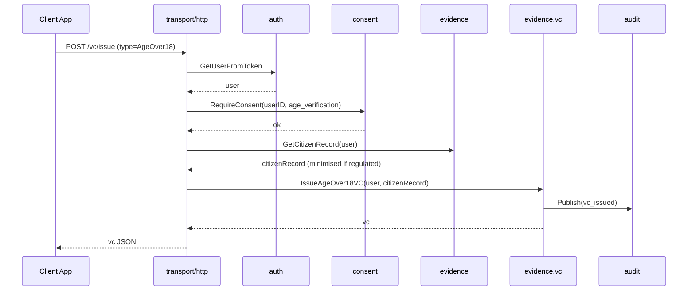
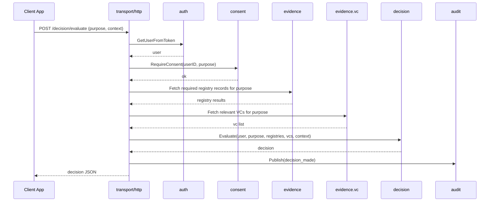
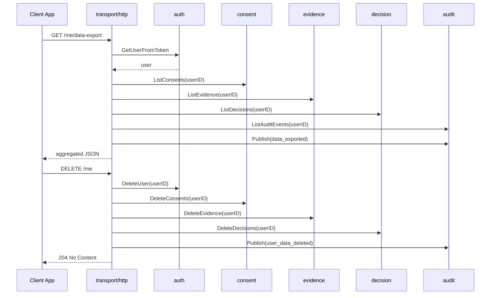

# Identity Verification Gateway - Architecture Documentation

This document describes the architecture of the Identity Verification Gateway: a Go service that simulates regulated identity verification flows, consent, registry checks, and verifiable credentials.

The runtime is a single process (modular monolith), but internal packages are structured along clear service boundaries so that it could be split into microservices later.

## Status

This document covers both current architecture and planned migrations. Sections labeled
"Planned" describe future work (gRPC, microservices, Phase 7 services). Current state
uses in-process adapters for service-to-service calls and HTTP/JSON for external APIs.

> **See also:** [C4 Architecture Diagrams](../architecture/c4/README.md) for interactive visual representations of this architecture at all four C4 levels (Context, Container, Component, Code).

## Table of Contents

- [High Level Architecture](#high-level-architecture)
- [Service Boundaries inside the Monolith](#service-boundaries-inside-the-monolith)
- [Package Layout](#package-layout)
- [User Scenarios](#user-scenarios)
- [Component Breakdown](#component-breakdown)

  - [Auth](#auth)
  - [Consent](#consent)
  - [Evidence](#evidence)
  - [Decision](#decision)
  - [Audit](#audit)
  - [Rate Limiting](#rate-limiting)
  - [Tenant](#tenant)
  - [Admin](#admin)
  - [Transport HTTP](#transport-http)
  - [Platform](#platform)

- [Core Flows](#core-flows)

  - [Login and Consent](#login-and-consent)
  - [Verification and VC Issuance](#verification-and-vc-issuance)
  - [Decision Evaluation](#decision-evaluation)
  - [Data Export and Deletion](#data-export-and-deletion)

- [API Routes](#api-routes)
- [Data Model Overview](#data-model-overview)
- [Regulated Mode Behaviour](#regulated-mode-behaviour)
- [Productionisation Considerations](#productionisation-considerations)
- [Design Rationale](#design-rationale)

---

## High Level Architecture

```text
                 ┌────────────────────────────┐
                 │       Client Apps          │
                 │  Demo UI or partner apps   │
                 └─────────────┬──────────────┘
                               │ HTTP
                               ▼
                 ┌────────────────────────────┐
                 │      transport/http        │
                 │    routing and handlers    │
                 └─────────────┬──────────────┘
                               │ calls into services
                               ▼
      ┌─────────────── internal (same process) ─────────────────┐
      │                                                         │
      │  ┌─────────┐  ┌───────────┐  ┌───────────┐  ┌────────┐  │
      │  │  auth   │  │  consent  │  │ evidence  │  │decision│  │
      │  │ users   │  │ purposes  │  │ registry  │  │ engine │  │
      │  │ sessions│  │ lifecycle │  │ vc        │  │ rules  │  │
      │  └────┬────┘  └─────┬─────┘  └─────┬─────┘  └────┬───┘  │
      │       │             │               │             │     │
      │       └──────────┬──┴───────────────┴─────────────┘     │
      │                  ▼                                      │
      │               ┌───────┐                                 │
      │               │ audit │                                 │
      │               │ queue │                                 │
      │               └──┬────┘                                 │
      │                  ▼                                      │
      │              storage layer                              │
      └─────────────────────────────────────────────────────────┘

                       ▼
                Observability, logs
```

Everything runs in one binary, but each internal package has a clear responsibility and limited dependencies.

Current runtime uses PostgreSQL as the system of record, Redis for session/token revocation and registry cache
lookups, and Kafka for audit event streaming via the outbox pipeline. In-memory stores are test-only.

---

## Interservice Communication Model

### Hexagonal Architecture (Ports and Adapters)

Credo follows **hexagonal architecture** (also known as ports-and-adapters) to keep the core business logic independent of communication protocols:

```text
┌──────────────────────────────────────────────────────────────┐
│                     External Layer (HTTP)                     │
│  ┌────────────────────────────────────────────────────────┐  │
│  │  HTTP Handlers (JSON/REST)                             │  │
│  │  - Public API for client apps                          │  │
│  │  - OAuth 2.0 endpoints                                 │  │
│  │  - Consent management                                  │  │
│  │  - VC issuance                                         │  │
│  └────────────────────┬───────────────────────────────────┘  │
└─────────────────────────┼──────────────────────────────────────┘
                         │ Calls
                         ▼
┌──────────────────────────────────────────────────────────────┐
│                    Service Layer (Domain)                     │
│  ┌────────────┐  ┌────────────┐  ┌─────────────────────┐    │
│  │   auth     │  │  consent   │  │  registry / vc      │    │
│  │  Service   │  │  Service   │  │  Service            │    │
│  └────────────┘  └────────────┘  └─────────────────────┘    │
│         │               │                   │                 │
│         │ Depends on    │ Depends on        │ Depends on     │
│         │ Ports         │ Ports             │ Ports          │
│         ▼               ▼                   ▼                 │
│  ┌──────────────────────────────────────────────────────┐    │
│  │             Port Interfaces (contracts)               │    │
│  │  - ConsentPort                                        │    │
│  │  - RegistryPort                                       │    │
│  │  - AuthPort                                           │    │
│  └──────────────────────────────────────────────────────┘    │
└────────────────────────────┬─────────────────────────────────┘
                             │ Implemented by
                             ▼
┌──────────────────────────────────────────────────────────────┐
│                  Adapter Layer (Infrastructure)               │
│  ┌────────────────────┐    ┌────────────────────────────┐    │
│  │  gRPC Adapters     │    │  HTTP Adapters (future)   │    │
│  │                    │    │                           │    │
│  │  ┌──────────────┐  │    │  ┌──────────────────────┐ │    │
│  │  │ gRPC Client  │  │    │  │   HTTP Client       │ │    │
│  │  │ (outbound)   │  │    │  │   (external APIs)   │ │    │
│  │  └──────────────┘  │    │  └──────────────────────┘ │    │
│  │                    │    │                           │    │
│  │  ┌──────────────┐  │    │                           │    │
│  │  │ gRPC Server  │  │    │                           │    │
│  │  │ (inbound)    │  │    │                           │    │
│  │  └──────────────┘  │    │                           │    │
│  └────────────────────┘    └────────────────────────────┘    │
└──────────────────────────────────────────────────────────────┘
```

### Communication Boundaries

**External API (HTTP/JSON):**

- Client applications → Gateway
- Protocol: HTTP/1.1, JSON
- Auth: Bearer tokens (JWT)
- Location: `internal/transport/http/`

**Internal API (Current):**

- Service → Service (within the monolith)
- Protocol: in-process adapters implementing port interfaces
- Location: `internal/*/ports/`, `internal/*/adapters/`

**Internal API (Planned gRPC/Protobuf):**

- Service → Service (within monolith)
- Protocol: gRPC over HTTP/2, Protobuf
- Auth: Mutual TLS (future), metadata propagation
- Location: `api/proto/`, `internal/*/adapters/grpc/`

### Why gRPC for Interservice Communication? (Planned)

1. **Type Safety**: Protobuf contracts prevent breaking changes
2. **Performance**: Binary serialization, HTTP/2 multiplexing
3. **Service Boundaries**: Clear contracts enable microservices migration
4. **Observability**: Built-in tracing, deadlines, metadata propagation
5. **Resilience**: Connection pooling, load balancing, circuit breakers

### Interservice Flow Example (Planned gRPC)

**Registry Service calls Consent Service:**

```go
// 1. Registry service depends on ConsentPort interface (domain layer)
type Service struct {
    consentPort ports.ConsentPort  // <-- Port (interface)
}

// 2. gRPC adapter implements ConsentPort
type ConsentClient struct {
    client consentpb.ConsentServiceClient  // Generated gRPC client
}

func (c *ConsentClient) RequireConsent(ctx, userID, purpose) error {
    // Translate domain call to gRPC
    resp, err := c.client.RequireConsent(ctx, &consentpb.RequireConsentRequest{
        UserId: userID,
        Purpose: mapPurposeToProto(purpose),
    })
    // Translate gRPC response to domain error
    return mapGRPCError(err)
}

// 3. Wiring (dependency injection in main.go)
consentClient := grpc.NewConsentClient("localhost:9091")
registryService := registry.NewService(
    store,
    consentClient,  // <-- Injected adapter
)
```

**Benefits:**

- Registry service has no gRPC imports in core logic
- Easy to mock ConsentPort for testing
- Can swap gRPC for HTTP or in-process calls without changing service code

### Protobuf Contracts

These definitions exist for the planned gRPC migration and are not used at runtime yet.

Protobuf definitions live in `api/proto/`:

```
api/proto/
  common.proto       # Shared types (RequestMetadata, Error, HealthCheck)
  consent.proto      # Consent service API
  registry.proto     # Registry service API
  auth.proto         # Auth service API
```

Generated Go code:

```
api/proto/
  common/commonpb/   # Generated Go package
  consent/consentpb/ # Generated Go package
  registry/registrypb/
  auth/authpb/
```

### Migration Path to Microservices

The hexagonal architecture enables zero-downtime migration:

1. **Phase 0 (Current)**: Monolith with in-process adapters
   - All services in single process
   - Port interfaces define module boundaries
   - In-process adapters implement ports
   - No gRPC overhead
2. **Phase 1**: Extract consent service to separate process
   - Implement gRPC server/client adapters
   - Start consent gRPC server on port 9091
   - Update registry to connect to `consent-service:9091`
   - **Zero code changes to domain logic** - just swap adapters
3. **Phase 2**: Extract more services (registry, auth, decision)
4. **Phase 3**: Add service mesh (Istio/Linkerd) for mTLS, tracing

---

## Service Boundaries inside the Monolith

1. **Auth Service**
   Users and sessions, OIDC lite login, tokens, userinfo.

2. **Consent and Policy Service**
   Purpose based consent, consent lifecycle, policy rules.

3. **Evidence Service**
   Registry checks (citizen, PEP sanctions), verifiable credential issuance and verification.

4. **Decision Service**
   Decision engine that combines evidence, purpose, and context.

5. **Audit Service**
   Append only audit log, queue consumer, durable audit storage.

6. **Rate Limiting Service**
   Per-IP and per-user rate limits, sliding window algorithm, allowlist management, partner API quotas.

7. **Tenant Service**
   Multi-tenancy support, client management, API key handling, tenant isolation.

8. **Admin Service**
   Administrative operations, user management, session controls, system administration.

9. **Trust Score Service** (Phase 7)
   Privacy-preserving reputation scoring, score calculation from verification/credentials/history, ZKP-provable score proofs, cross-service score sharing.

10. **Compliance Service** (Phase 7)
    Compliance-as-code templates (GDPR, CCPA, HIPAA, PCI-DSS, SOC2), template application and composition, compliance status tracking.

11. **Analytics Service** (Phase 7)
    Privacy-preserving analytics with differential privacy, aggregate queries without PII access, privacy budget management, query audit trails.

12. **Trust Network Service** (Phase 7)
    Federated web of trust, peer vouching with weighted trust, ZKP vouches for privacy-preserving vouching, fraud detection (circular vouching, velocity limits).

---

## Package Layout

```text
api/
  proto/                        # Protobuf definitions (planned gRPC)

cmd/
  server/                       # Main application entrypoint

contracts/
  registry/                     # PII-light DTO contracts, versioned separately

internal/
  platform/
    config/                     # Configuration loading
    database/                   # PostgreSQL connection pooling
    kafka/                      # Kafka producer/consumer + health checks
    logger/                     # Structured logging with slog
    httpserver/                 # Shared HTTP server setup
    middleware/                 # HTTP middleware (recovery, logging, request ID, latency, JWT auth, device, admin)
    metrics/                    # Prometheus metrics collection
    redis/                      # Redis client and health checks
  jwt_token/
    jwt.go                      # JWT generation and validation with HS256
    jwt_adapter.go              # Adapter for middleware interface
  auth/
    adapters/                   # In-process adapters
    device/                     # Device binding helpers
    email/                      # Email helpers
    handler/                    # HTTP handlers for auth endpoints
    ports/                      # Port interfaces
    service/                    # Domain logic
    store/                      # Persistence layer
    models/                     # Domain models
    workers/                    # Background cleanup workers
  consent/
    handler/                    # HTTP handlers for consent endpoints
    service/                    # Consent domain logic
    store/                      # Consent store (port + impl)
    models/                     # Domain models
  registry/
    ports/                      # Consent port
    adapters/                   # In-process adapters
    service/                    # Registry orchestration, caching, minimization
    clients/                    # Registry mocks/providers
    handler/                    # Optional HTTP adapter (demo)
    models/                     # Registry models
    store/                      # Registry cache store
  decision/
    ports/                      # Registry/consent ports
    adapters/                   # In-process adapters
    service/                    # Decision engine
  evidence/
    registry/                   # Registry evidence subsystem
    vc/                         # Verifiable credentials subsystem
  ratelimit/                    # Rate limiting module
    admin/                      # Admin operations
    handler/                    # HTTP handlers
    middleware/                 # Enforcement middleware
    service/                    # Orchestration and policy
    store/                      # Persistence
  tenant/                       # Multi-tenancy module
    handler/                    # HTTP handlers
    service/                    # Tenant/client orchestration
    models/                     # Domain models
    store/                      # PostgreSQL stores; in-memory for tests
  admin/                        # Administrative operations
  transport/
    http/                       # HTTP routing and handlers
  seeder/                       # Demo data population

pkg/
  domain/                       # Typed IDs and domain primitives
  domain-errors/                # Domain error codes
  platform/
    audit/                      # Audit models, publishers, outbox store
```

Rules of thumb:

- `transport/http` depends on services only, not on storage details.
- Services depend on their own stores and on other services through interfaces, not on handlers.
- `pkg/platform/audit` is a shared dependency all services can call to emit events.
- `platform` provides cross cutting concerns: config, logging, middleware, metrics, and HTTP server setup.

---

## User Scenarios

### Scenario 1 - Fintech age verification for onboarding

- Auth service logs the user in and issues tokens.
- Consent service records consent for `age_verification`.
- Evidence service calls citizen registry, derives `is_over_18`, issues an `AgeOver18` VC.
- Decision service uses registry evidence and VC to return `pass`.
- Audit service records login, consent, registry query, VC issuance, and decision.

### Scenario 2 - Sanctions check for high risk operation

- Auth service identifies current user via access token.
- Consent service verifies consent for `sanctions_screening`.
- Evidence service calls sanctions registry and returns `IsPep`, `IsSanctioned`.
- Decision service returns `fail` or `pass_with_conditions` based on policy.
- Audit service records the decision with reason.

### Scenario 3 - Data export and deletion for user rights

- Status: Planned. `/me/data-export` and `/me` handlers are stubbed in current code.

- Auth service identifies user.
- Consent, evidence, decision, and audit services expose read methods via their stores to gather all data for the user.
- Transport layer exposes `/me/data-export` and `/me` on top of these services.
- Audit service records `data_exported` and `user_data_deleted` events.

---

## Component Breakdown

### Auth

**Responsibilities**

- Manage `User` and `Session` objects.
- Implement minimal OIDC like behaviour: authorize, token, userinfo.
- Provide a helper to resolve the current user from an access token for other services.

**Key types**

```go
type User struct {
    ID        id.UserID
    TenantID  id.TenantID
    Email     string
    FirstName string
    LastName  string
    Verified  bool
    Status    UserStatus
}

type Session struct {
    ID             id.SessionID
    UserID         id.UserID
    ClientID       id.ClientID
    TenantID       id.TenantID
    RequestedScope []string
    Status         SessionStatus // "pending_consent", "active", "revoked"
    DeviceID       string        // Cookie-bound device ID
    DeviceFingerprintHash string // Secondary signal (hash)
    CreatedAt      time.Time
    ExpiresAt      time.Time
    LastSeenAt     time.Time
    RevokedAt      *time.Time
}
```

**Clients**

- Called by `transport/http` for login and token endpoints.
- Called by `transport/http` to resolve current user for any authenticated endpoints.

---

### Consent

**Responsibilities**

- Model purpose based consent as first class data.
- Enforce consent requirements before sensitive operations.
- Provide a stable enforcement API used by other services.
- Maintain read-optimized projections for high-volume consent checks.

**Key types**

```go
type Purpose string

const (
    PurposeLogin         Purpose = "login"
    PurposeRegistryCheck Purpose = "registry_check"
    PurposeVCIssuance    Purpose = "vc_issuance"
    PurposeDecision      Purpose = "decision_evaluation"
)

type ConsentRecord struct {
    ID        string     // UUID reused per user+purpose
    UserID    string
    Purpose   Purpose
    GrantedAt time.Time
    ExpiresAt *time.Time
    RevokedAt *time.Time
}

type ConsentScope struct {
    UserID  string
    Purpose Purpose
}
```

**Service**

- `Grant(userID, []Purpose) error`
- `Revoke(userID, []Purpose) error`
- `Require(userID, Purpose) error` - Returns error if no active consent.
- `List(userID) []ConsentRecord`

**Production Evolution (PRD-002 TR-6):**

- **Write model:** Consent service writes canonical records to `ConsentStore` (PostgreSQL) and emits `consent_granted`/`consent_revoked` events to Kafka after commit (via outbox).
- **Read model:** Projection workers consume events and maintain a Redis/DynamoDB read model keyed by `user_id:purpose` with `{status, expires_at, revoked_at, version}` for sub-5ms lookups.
- **Consistency:** Projection lag budget ≤1s; `Require()` checks projection first, falls back to canonical store on cache miss.
- **Resilience:** Replay tool rebuilds projections from audit log; outbox pattern guarantees event delivery; no-eviction Redis policy for consent projections.

**Services**

- `Grant(ctx, userID, purposes []Purpose)` - Grant/renew consent for multiple purposes
  - **Idempotency**: If active consent granted < 5 minutes ago, returns existing without update (no audit)
  - **ID Reuse**: Always reuses existing consent IDs (active, expired, revoked)
  - **TTL Extension**: If active consent ≥ 5 minutes old, updates timestamps (supports sessions)
- `Revoke(ctx, userID, purposes []Purpose)` - Revoke consent for multiple purposes
- `List(ctx, userID, filter)` - List all consents with status (active/expired/revoked)
- `Require(ctx, userID, purpose)` - Returns typed errors `ErrMissingConsent`, `ErrConsentExpired`

**Idempotency Design**:
To prevent audit noise from rapid repeated requests (double-clicks, retries), consent grants within a 5-minute window are idempotent for active consents. This balances:

- Preventing duplicate audit events
- Supporting legitimate session TTL extensions
- Ensuring expired/revoked consents are always renewable

**Clients**

- Called by `transport/http` on `/auth/consent`.
- Called by `evidence` and `decision` services to enforce requirements.

---

### Evidence

Evidence is split into `registry` and `vc`.

#### Registry

**Responsibilities**

- Integrate with citizen and sanctions registries through pluggable provider abstraction
- Orchestrate multi-source evidence gathering with fallback chains and correlation rules
- Cache results with TTL
- Apply minimisation when regulated mode is active
- Normalize errors across different registry providers

**Subdomain Architecture**

The Registry bounded context is organized into two first-class subdomains with a shared kernel:

```
internal/evidence/registry/domain/
├── shared/              # Shared Kernel
│   └── types.go         # NationalID, Confidence, CheckedAt, ProviderID
├── citizen/             # Citizen Subdomain
│   └── citizen.go       # CitizenVerification aggregate
└── sanctions/           # Sanctions Subdomain
    └── sanctions.go     # SanctionsCheck aggregate
```

- **Citizen Subdomain**: Identity verification through population registries. Contains PII with GDPR-compliant minimization.
- **Sanctions Subdomain**: Compliance screening against sanctions lists and PEP databases. No PII minimization needed.
- **Shared Kernel**: Common types (`NationalID`, `Confidence`, `CheckedAt`, `ProviderID`) used by both subdomains.
- **Domain Purity**: All domain packages have no I/O, no `context.Context`, and no `time.Now()` calls.

See `internal/evidence/registry/README.md` and `docs/prd/PRD-003-Registry-Integration.md` for complete details.

**Key types**

```go
type CitizenRecord struct {
    NationalID  string // Unique national identifier
    FullName    string // Full legal name
    DateOfBirth string // Format: YYYY-MM-DD
    Valid       bool   // Whether record is valid/active
}

type SanctionsRecord struct {
    NationalID string // Unique national identifier
    Listed     bool   // Whether person is on sanctions/PEP list
    Source     string // Source of the flag
}

type RegistryResult struct {
    Citizen  *CitizenRecord
    Sanction *SanctionsRecord
}
```

**Service**

- `Check(ctx, nationalID)` - Returns both citizen and sanctions records via orchestrator
- `Citizen(ctx, nationalID)` - Returns citizen record from cache or provider
- `Sanctions(ctx, nationalID)` - Returns sanctions record from cache or provider

This service uses the orchestrator to coordinate lookups across multiple providers with automatic fallback, retry logic, and evidence correlation.

**Provider Abstraction Architecture**

The registry module implements a comprehensive provider abstraction layer:

- **Provider Interface**: Universal contract enabling pluggable integration with any registry source (HTTP today; SOAP/gRPC planned) without modifying service layer code

- **Protocol Adapters**: Separate protocol concerns from business logic. HTTP adapter handles REST APIs; SOAP and gRPC adapters are planned for future providers

- **Error Taxonomy**: Eight normalized error categories (timeout, bad_data, authentication, provider_outage, contract_mismatch, not_found, rate_limited, internal) with automatic retry semantics based on error type

- **Orchestrator**: Coordinates multi-source evidence gathering with four strategies:

  - Primary: Uses single provider for fast responses
  - Fallback: Tries primary then alternatives on failure
  - Parallel: Queries all providers simultaneously
  - Voting: Uses consensus or highest confidence from multiple sources

- **Correlation Rules**: Pluggable logic for merging conflicting evidence from multiple sources, reconciling field discrepancies, and computing weighted confidence scores

- **Capability Negotiation**: Providers declare supported fields, filters, and API versions. System validates compatibility and routes requests to appropriate providers

- **Contract Testing**: Framework for validating provider outputs against expected schemas and detecting API version changes before deployment

This architecture enables:

- Adding new registry providers without changing callers
- Automatic failover to backup providers
- Correlation of conflicting data from multiple sources
- Protocol-agnostic integration (HTTP today; SOAP/gRPC planned)
- Consistent error handling and retry policies
- Provider health monitoring and circuit breaking

**Cross-module contracts**

- `contracts/registry` defines the PII-light DTOs (`CitizenRecord{DateOfBirth, Valid}`, `SanctionsRecord{Listed}`) and a `ContractVersion` for compatibility.
- The registry service maps internal models into these DTOs before handing data to decision or other modules; raw identifiers stay inside the registry boundary.
- Decision imports only the contract package, avoiding reach into registry internals and keeping the future microservice split clean.
- PII minimization is enforced by passing only derived/necessary fields across the boundary.
- Provider abstraction maintains clear separation between external integrations and internal domain models.

#### VC

**Responsibilities**

- Issue and verify simple verifiable credentials such as `AgeOver18`.
- Store and revoke credentials.

**Key types**

```go
type VerifiableCredential struct {
    ID       string
    UserID   string
    Type     string
    Issuer   string
    IssuedAt time.Time
    Claims   map[string]any
    Revoked  bool
}
```

**Service**

- `Issue(ctx, IssueRequest)` - Issues a verifiable credential based on type and claims
- `Verify(ctx, credentialID)` - Verifies a credential exists and is not revoked

The service supports claim minimization in regulated mode using `MinimizeClaims()` which removes PII keys like full_name, national_id, and date_of_birth.

---

### Decision

**Responsibilities**

- Combine purpose, user, evidence, and context into a decision.
- Encapsulate business rules for `age_verification`, `sanctions_screening`, and any other purposes.
- Cache evidence lookups and maintain decision history for idempotent retries.

**Key types**

```go
type DecisionOutcome string

const (
    DecisionPass               DecisionOutcome = "pass"
    DecisionPassWithConditions DecisionOutcome = "pass_with_conditions"
    DecisionFail               DecisionOutcome = "fail"
)

type DerivedIdentity struct {
    PseudonymousID string // user pseudonym, not email/name
    IsOver18       bool   // derived from DOB or credential
    CitizenValid   bool   // registry validity flag
}

type DecisionInput struct {
    Identity   DerivedIdentity
    Sanctions  registrycontracts.SanctionsRecord // PII-light contract (listed flag)
    Credential vc.Claims                          // minimized VC claims
}
```

**Service**

- `Evaluate(ctx, DecisionInput) DecisionOutcome`

`DecisionInput` keeps the engine dependency-free: derived identity flags, a contract `SanctionsRecord` (listed flag only), and minimized VC claims. No raw PII or registry internals cross the boundary.

**Production Evolution (PRD-005 TR-5):**

- **Write model:** Decision service orchestrates registry/VC/audit lookups and emits `decision_made` events to Kafka with full input/output context.
- **Read model:** NoSQL projection (Redis/DynamoDB) stores recent decisions by `user_id+purpose` for fast re-checks and idempotent retries; fields include `status`, `reason`, `conditions`, `evaluated_at`, `evidence_hash`.
- **Evidence caches:** Registry and VC results cached in Redis with short TTLs (30s-5m) aligned to upstream refresh rates to avoid evaluation bursts.
- **Event consumers:** Downstream services (risk scoring, audit indexing, analytics) subscribe to `decision_made` events without coupling to HTTP layer.
- **Consistency:** Write path is source of truth; read projections eventually consistent (≤1s lag); fall back to canonical evaluation on cache miss or staleness.

---

### Audit

**Responsibilities**

- Provide a simple API for other services to publish audit events.
- Decouple publishing from persistence using the outbox and Kafka pipeline.
- Persist events in an `AuditStore` and log them.
- Stream events to downstream consumers (indexing, analytics, compliance dashboards).

**Key types**

```go
type EventCategory string

const (
    CategoryCompliance  EventCategory = "compliance"  // Legal/regulatory significance
    CategorySecurity    EventCategory = "security"    // Security monitoring, SIEM
    CategoryOperations  EventCategory = "operations"  // Debugging, telemetry
)

type Event struct {
    Category  EventCategory // Event classification for routing/retention
    Timestamp time.Time     // When event occurred
    UserID    string        // Subject user ID
    Action    string        // What happened (e.g., "consent_granted")
    Purpose   string        // Why (e.g., "registry_check")
    Decision  string        // Outcome (e.g., "granted", "pass", "fail")
    Reason    string        // Human-readable reason
    RequestID string        // Correlation ID for tracing
    ActorID   string        // Admin performing action on behalf of user
}
```

**Event Categories**

Events are classified into three categories to enable different retention policies, storage backends, and routing:

| Category | Purpose | Retention | Downstream |
|----------|---------|-----------|------------|
| `compliance` | Legal/regulatory significance (GDPR, consent) | 7+ years, tamper-proof | Compliance exports, legal holds |
| `security` | Security monitoring and forensics | 90 days | SIEM, alerting, threat detection |
| `operations` | Debugging and operational visibility | 7-30 days | Dashboards, on-call debugging |

**Category Assignments:**

| Category | Events |
|----------|--------|
| `compliance` | `user_created`, `user_deleted`, `consent_granted`, `consent_revoked`, `consent_deleted` |
| `security` | `auth_failed`, `session_revoked`, `sessions_revoked`, `client_secret_rotated`, `rate_limit_exceeded`, `auth_lockout_triggered`, `auth_lockout_cleared`, `allowlist_bypassed`, `tenant_deactivated`, `client_deactivated` |
| `operations` | `session_created`, `token_issued`, `token_refreshed`, `userinfo_accessed`, `consent_checked`, `tenant_created`, `tenant_reactivated`, `client_created`, `client_reactivated` |

Unknown events default to `operations` category.

**Components**

- **Tri-publisher system** (`pkg/platform/audit/publishers`):
  - **Compliance**: synchronous, fail-closed persistence (operations fail if audit write fails).
  - **Security**: async buffered with retry and flush for SIEM pipelines.
  - **Ops**: fire-and-forget with sampling and circuit breaker for high-volume telemetry.
- `audit.Store` backed by PostgreSQL outbox entries (Kafka payloads).
- `outbox` worker publishes entries to Kafka (`credo.audit.events` by default).
- Kafka consumer materializes events into `audit_events` for querying and exports.

**Clients**

- Called by auth, consent, evidence, decision, and transport layers when key actions occur.

**Production Evolution (PRD-006 TR-5):**

- **Write path (current):** Services emit via compliance/security/ops publishers → PostgreSQL outbox → Kafka.
- **Read path (current):** Kafka consumer materializes `audit_events` table for admin and user queries.
- **Read path (planned):** Elasticsearch/OpenSearch index fed by Kafka consumers for cross-user investigations.
- **Reliability:** Outbox pattern guarantees at-least-once delivery; consumers use event IDs for idempotent processing.
- **Storage tiers (planned):** Hot queries (24h) cached in Redis; warm queries (7d) in ES; cold queries (90d+) in object store with presigned export URLs.

---

### Rate Limiting

**Responsibilities** (PRD-017)

- Enforce per-IP rate limits by endpoint class (auth, sensitive, read, write).
- Enforce per-user rate limits for authenticated endpoints.
- Manage allowlists for bypassing rate limits.
- Track partner API quotas for monthly usage.
- Provide global throttling for DDoS protection.

**Key types**

```go
type RateLimitClass string

const (
    ClassAuth      RateLimitClass = "auth"      // 10 req/min
    ClassSensitive RateLimitClass = "sensitive" // 30 req/min
    ClassRead      RateLimitClass = "read"      // 100 req/min
    ClassWrite     RateLimitClass = "write"     // 50 req/min
)

type AllowlistEntry struct {
    Type       string    // "ip" or "user"
    Identifier string    // IP address or user ID
    Reason     string    // Why allowlisted
    ExpiresAt  time.Time // When allowlist expires
}
```

**Components**

- `service/` - Rate limiting logic and orchestration
- `middleware/` - HTTP middleware for enforcement
- `store/bucket/` - Sliding window counters (PostgreSQL)
- `store/allowlist/` - Allowlist entries
- `handler/` - Admin endpoints for allowlist management

**Response Headers**

```
X-RateLimit-Limit: 10
X-RateLimit-Remaining: 7
X-RateLimit-Reset: 1735934400
Retry-After: 45  (when rate limited)
```

---

### Tenant

**Responsibilities** (PRD-026A, PRD-026B)

- Manage multi-tenant isolation.
- Handle client registration and API key management.
- Enforce tenant-scoped access controls.
- Lifecycle management: deactivate/reactivate tenants and clients.

**Key types**

```go
type Tenant struct {
    ID        string
    Name      string
    Status    string    // "active", "inactive"
    CreatedAt time.Time
}

type Client struct {
    ID        string
    TenantID  string
    Name      string
    Secret    string    // Hashed client secret
    Status    string    // "active", "inactive"
    CreatedAt time.Time
}
```

**Components**

- `service/` - Tenant and client orchestration, lifecycle management
- `handler/` - HTTP handlers for admin endpoints
- `store/` - PostgreSQL tenant/client stores; in-memory for tests
- `models/` - Domain models

**Lifecycle Operations** (PRD-026B):

- `DeactivateTenant(ctx, tenantID)` - Blocks all OAuth flows for tenant's clients
- `ReactivateTenant(ctx, tenantID)` - Restores tenant to active status
- `DeactivateClient(ctx, clientID)` - Blocks OAuth flows for specific client
- `ReactivateClient(ctx, clientID)` - Restores client to active status

---

### Admin

**Responsibilities** (PRD-001B)

- Handle administrative operations.
- Manage user deletion with cascade.
- Control session management across users.

**Components**

- `handler.go` - HTTP handlers for admin endpoints
- `service.go` - Admin business logic

**Admin Operations**

- Delete user and cascade all related data (sessions, consents, tokens)
- List and revoke user sessions
- System-wide administrative controls

---

### Transport HTTP

**Responsibilities**

- Expose REST endpoints.
- Marshal and unmarshal JSON.
- Handle errors and HTTP status codes.
- Call into services only, no business rules.

Key handlers grouped by file, for example:

- `handlers_auth.go` for `/auth/*` endpoints.
- `handlers_consent.go` for `/auth/consent`.
- `handlers_evidence.go` for `/vc/*` or registry endpoints if you expose them.
- `handlers_decision.go` for `/decision/evaluate`.
- `handlers_me.go` for `/me/data-export` and `/me`.

---

### Platform

**Responsibilities**

- Cross cutting concerns, not domain logic.

**Components:**

- **Config** - Environment variable loading and configuration management
- **Logger** - Structured logging with slog
  - Context-aware logging (InfoContext, WarnContext, ErrorContext)
  - Automatic request_id extraction from context for distributed tracing
  - JSON output format for production observability
- **Middleware** - HTTP middleware stack (see Middleware section below)
- **Metrics** - Prometheus metrics collection and exposition at `/metrics`
- **HTTP Server** - Server startup and graceful shutdown handling

---

### Middleware

**Responsibilities**

- Provide reusable HTTP middleware for cross-cutting concerns
- Request tracing, logging, recovery, timeouts, and metrics collection

**Available Middleware:**

- `Recovery(logger)` - Recovers from panics and logs with context and request_id
- `RequestID` - Injects unique request ID into context and response headers
- `Logger(logger)` - Logs all HTTP requests with context-aware structured logging
- `Timeout(duration)` - Enforces request timeout (default: 30 seconds)
- `ContentTypeJSON` - Validates Content-Type header for POST/PUT/PATCH requests
- `LatencyMiddleware(metrics)` - Tracks endpoint latency in Prometheus histogram
- `RequireAuth(validator, logger)` - Validates JWT tokens and populates user_id, session_id, client_id in context
- `RequireAdminToken(token, logger)` - Validates admin API token for administrative endpoints (port 8081)
- `DeviceFingerprint(service, logger)` - Extracts and validates device fingerprint from requests for device binding
- `Metadata` - Extracts request metadata (IP, user-agent) into context

**Rate Limiting Middleware** (PRD-017):

- `RateLimit(class)` - Enforces per-IP rate limits by endpoint class (auth, sensitive, read, write)
- `RateLimitAuthenticated(class)` - Enforces per-user rate limits for authenticated endpoints

**Device Binding Middleware** (PRD-001):

The device binding system has an intentional architectural split:

- **Extraction (Middleware):** `Device(config)` middleware extracts device ID from cookie and pre-computes fingerprint on every request. This is a cross-cutting concern needed by multiple endpoints.
- **Setting (Handler):** Device ID cookie is set only by the auth handler on `/auth/authorize` response. This is business logic specific to the authorization flow.

This asymmetry exists because:
1. Extraction is infrastructure (runs on all requests, injects into context)
2. Setting is business logic (only during authorization, part of auth service response)

See `docs/security/DEVICE_BINDING.md` for the full security model.

All middleware supports context propagation and includes request_id for distributed tracing.

**JWT Authentication:**

The system uses JWT (JSON Web Tokens) for access token authentication:

- Tokens signed with HS256 (HMAC-SHA256) using a configurable signing key
- Claims include: user_id, session_id, client_id, exp, iat, iss, aud
- Validated via `RequireAuth` middleware on protected endpoints
- User context (user_id, session_id, client_id) extracted from JWT and stored in request context
- Helper functions: `GetUserID(ctx)`, `GetSessionID(ctx)`, `GetClientID(ctx)`

**Metrics Collected:**

- `id_gateway_users_created_total` - Counter for total users created
- `id_gateway_active_sessions` - Gauge for current active sessions
- `id_gateway_token_requests_total` - Counter for token exchange requests
- `id_gateway_auth_failures_total` - Counter for authentication failures
- `id_gateway_endpoint_latency_seconds` - Histogram for endpoint latency by path

---

## Storage and Caching Architecture

### Evolution Strategy

Credo follows a **progressive enhancement** approach to storage and caching:

**Phase 1 - Current Baseline:**

- PostgreSQL as canonical store for all services
- Redis for sessions, token revocation, and registry cache lookups
- Kafka audit pipeline via outbox worker and consumer
- In-memory stores used only in tests

**Phase 2 - Production Hardening (Planned):**

- Redis projections for consent/decision hot paths (CQRS read models)
- Kafka topics for consent changes, decision outcomes, and VC events
- Outbox/inbox pattern generalized across services

**Phase 3 - Scale and Observability (Planned):**

- CQRS read models for high-volume queries
- Elasticsearch/OpenSearch for searchable audit index
- Distributed tracing with OpenTelemetry

### Storage Tiers

| Tier      | Technology             | Use Cases                                                | TTL Strategy                                  |
| --------- | ---------------------- | -------------------------------------------------------- | --------------------------------------------- |
| **Write** | PostgreSQL             | Canonical consent, users, auth codes, refresh tokens     | N/A (durable)                                 |
| **Hot**   | Redis (implemented)    | Sessions, token revocation list (TRL), registry cache    | Session TTL, token expiry                     |
| **Hot**   | Redis (planned)        | Consent projections, decision cache, rate limiting       | Align with domain expiry (consent, sanctions) |
| **Warm**  | Elasticsearch          | Audit index, compliance queries, investigations          | Time-based indices (daily/weekly)             |
| **Cold**  | S3 / Object Store      | Audit archive, GDPR exports, long-term compliance        | Lifecycle policies (90d+ retention)           |

Note: In-memory stores are test-only and do not run in production.

### Event Bus Architecture

**Topics and Consumers:**

```
audit_events (current) → [audit_events_materializer]
consent_events (planned) → [projection_worker, audit_indexer, analytics]
decision_events (planned) → [risk_scorer, audit_indexer, compliance_dashboard]
registry_refresh (planned) → [cache_warmer, evidence_projector]
```

**Reliability Patterns:**

- **Outbox pattern:** Services persist events alongside writes; background workers ship to Kafka
- **Consumer idempotency:** Event IDs and versions prevent duplicate processing
- **Dead-letter queues:** Per-topic DLQs with exponential backoff for failed consumers
- **Offset management:** Consumer groups track offsets for resume-on-failure

### Cache Consistency Model

**Eventual consistency budget:** ≤1s lag for consent/decision projections

**Fallback strategy:**

1. Primary: Read from projection (Redis/DynamoDB)
2. Cache miss: Query canonical store (PostgreSQL) + refresh projection
3. Stale detection: Compare version fields; trigger background refresh
4. Degraded mode: Bypass cache on Redis unavailability; direct canonical store

**Eviction policies:**

- **Consent projections:** No random eviction (allkeys-lru disabled); only TTL-based expiry
- **Evidence cache:** LRU with 30s-5m TTL aligned to upstream refresh rates
- **Session throttle:** LRU acceptable; false negatives fail-open with logging

### Circuit Breaker Pattern

Cross-module dependencies use circuit breakers to prevent cascade failures:

**ClientResolver (Auth → Tenant):**

- Failure threshold: 5 consecutive failures opens circuit
- Success threshold: 3 consecutive successes closes circuit
- Fallback: Returns cached client data when circuit is open
- Cache TTL: 5 minutes

This pattern is applied to any synchronous cross-module call where:

1. The dependency could experience transient failures
2. Cached/stale data is acceptable as a fallback
3. Fail-fast is preferable to blocking on a degraded service

See `internal/ratelimit/middleware/circuitbreaker.go` for the reference implementation.

---

## Core Flows

### Login and Consent



---

### Verification and VC Issuance



---

### Decision Evaluation



---

### Data Export and Deletion

Status: Planned. `/me/data-export` and `/me` are stubbed in current code.



---

## API Routes

The system exposes two HTTP servers:

### Public API (Port 8080)

**Unauthenticated Routes:**

| Method | Path | Description |
|--------|------|-------------|
| POST | `/auth/authorize` | OAuth 2.0 authorization code issuance |
| POST | `/auth/token` | Token exchange (code → access/refresh tokens) |
| POST | `/auth/revoke` | Token revocation (RFC 7009) |
| GET | `/health` | Health check endpoint |
| GET | `/metrics` | Prometheus metrics |
| GET | `/demo/info` | Demo metadata (demo mode only) |

**Authenticated Routes** (require valid JWT):

| Method | Path | Description |
|--------|------|-------------|
| GET | `/auth/userinfo` | User profile information |
| GET | `/auth/sessions` | List user's active sessions |
| DELETE | `/auth/sessions/{session_id}` | Revoke a specific session |
| POST | `/auth/consent` | Grant consent for purposes |
| POST | `/auth/consent/revoke` | Revoke consent for one or more purposes |
| POST | `/auth/consent/revoke-all` | Revoke all consents (bulk) |
| GET | `/auth/consent` | List user's consents |
| DELETE | `/auth/consent` | Delete all consents (GDPR) |

### Admin API (Port 8081)

Requires `X-Admin-Token` header for authentication.

**User Management (PRD-001B):**

| Method | Path | Description |
|--------|------|-------------|
| DELETE | `/admin/users/{user_id}` | Delete user and cascade all data |
| GET | `/admin/users/{user_id}/sessions` | List user's sessions |
| DELETE | `/admin/users/{user_id}/sessions` | Revoke all user sessions |

**Rate Limiting (PRD-017):**

| Method | Path | Description |
|--------|------|-------------|
| POST | `/admin/rate-limit/allowlist` | Add IP/user to allowlist |
| DELETE | `/admin/rate-limit/allowlist` | Remove from allowlist |
| POST | `/admin/rate-limit/reset` | Reset rate limit counter |

**Consent Management:**

| Method | Path | Description |
|--------|------|-------------|
| POST | `/admin/consent/users/{user_id}/revoke-all` | Revoke all consents for a user (security response) |

**Tenant Management (PRD-026A, PRD-026B):**

| Method | Path | Description |
|--------|------|-------------|
| POST | `/admin/tenants` | Create tenant |
| GET | `/admin/tenants` | List tenants |
| GET | `/admin/tenants/{tenant_id}` | Get tenant details |
| POST | `/admin/tenants/{tenant_id}/deactivate` | Deactivate tenant |
| POST | `/admin/tenants/{tenant_id}/reactivate` | Reactivate tenant |
| POST | `/admin/tenants/{tenant_id}/clients` | Create client for tenant |
| GET | `/admin/tenants/{tenant_id}/clients` | List tenant's clients |
| POST | `/admin/clients/{client_id}/deactivate` | Deactivate client |
| POST | `/admin/clients/{client_id}/reactivate` | Reactivate client |

---

## Data Model Overview

High level entities across services:

- `auth`

  - `User` - ID, Email, FirstName, LastName, Verified
  - `Session` - ID, UserID, Code, CodeExpiresAt, CodeUsed, ClientID, RedirectURI, RequestedScope, Status, CreatedAt, ExpiresAt

- `consent`

  - `ConsentPurpose` - Enum: login, registry_check, vc_issuance, decision_evaluation
  - `ConsentRecord` - ID, UserID, Purpose, GrantedAt, ExpiresAt, RevokedAt

- `evidence.registry`

  - `CitizenRecord` - NationalID, FullName, DateOfBirth (string), Valid
  - `SanctionsRecord` - NationalID, Listed, Source
  - Cached in `RegistryCacheStore` with 5-minute TTL; mapped to PII-light `contracts/registry` DTOs for cross-module sharing

- `evidence.vc`

  - `VerifiableCredential` - ID, Type, Subject, Issuer, IssuedAt, Claims (map), Revoked
  - `IssueRequest` / `IssueResult` - Request/response structures
  - `VerifyRequest` / `VerifyResult` - Verification structures

- `decision`

  - `DecisionInput` - Identity (DerivedIdentity), Sanctions (contract DTO), Credential (vc.Claims)
  - `DerivedIdentity` - PseudonymousID, IsOver18, CitizenValid (no PII)
  - `DecisionOutcome` - pass | pass_with_conditions | fail

- `audit`
  - `Event` - ID, Timestamp, UserID, Action, Purpose, Decision, Reason, RequestID

**Relationships:**

- All entities linked by `UserID`
- Purpose strings from `ConsentPurpose` enum
- DerivedIdentity computed from CitizenRecord without storing PII
- Audit events reference all operations but store no raw PII

---

## Regulated Mode Behaviour

`REGULATED_MODE=true` affects behaviour across services to enforce GDPR data minimization principles:

- `auth`
  Standard user and session management. May enforce stricter session duration in production.

- `consent`
  Mandatory for registry, VC, and decision flows. Missing consent returns HTTP 403 with typed error `CodeMissingConsent`.

- `evidence.registry`
  **Key minimization logic:**

  - Calls `MinimizeCitizenRecord()` before returning data when regulated.
  - Strips `NationalID`, `FullName`, and `DateOfBirth`; keeps only the `Valid` boolean in regulated mode.
  - Maps internal records to PII-light `contracts/registry` DTOs for downstream use; DOB may be omitted once minimized.
  - Cache TTL enforced at 5 minutes (from `config.RegistryCacheTTL`).
  - Sanctions records are not minimized, but only the `Listed` flag crosses the contract boundary; provider details stay internal.

- `evidence.vc`
  **Key minimization logic:**

  - Calls `MinimizeClaims()` before storing credentials
  - In regulated mode: removes keys `full_name`, `national_id`, `date_of_birth`, `verified_via`
  - Keeps only derived attributes (e.g., `is_over_18: true`)
  - Issues credentials with minimal claims, not raw identity data

- `decision`
  **Privacy-first design:**

  - Accepts `DerivedIdentity` with `IsOver18` and `CitizenValid`, plus contract `SanctionsRecord` and minimized VC claims.
  - No raw PII flows through the decision engine; registry internals and identifiers stay behind the contract boundary.
  - Policy rules operate on derived flags, not on raw DOB or names.

- `audit`
  Required for all sensitive operations. Events include action, purpose, decision, reason but avoid logging raw PII (use user IDs, not emails).

Having the code structured by services makes these toggles easier to reason about. The pattern is: **derive → decide → discard PII**.

---

## Productionisation Considerations

### Current State (Baseline)

**What's Implemented:**

- ✅ Complete domain models and service layer logic
- ✅ PostgreSQL stores (UserStore, SessionStore, ConsentStore, VCStore, RegistryCacheStore, AuditStore)
- ✅ Storage interfaces abstracted (production adapters implemented)
- ✅ Data minimization functions (MinimizeCitizenRecord, MinimizeClaims)
- ✅ Consent enforcement with typed errors
- ✅ Registry caching with TTL
- ✅ Derived identity pattern (PII-free decision making)
- ✅ HTTP routing and error mapping
- ✅ Config loading from environment
- ✅ OAuth 2.0 Authorization Code Flow (RFC 6749 compliant)
- ✅ Context-aware structured logging with slog
- ✅ HTTP middleware stack (recovery, request ID, logging, timeout, content-type, device, admin)
- ✅ Prometheus metrics collection and `/metrics` endpoint
- ✅ Comprehensive test coverage (unit, handler, integration tests)
- ✅ Tri-publisher audit system (compliance/security/ops) with outbox-backed store
- ✅ Kafka outbox pipeline for audit events (Postgres → Kafka → `audit_events`)
- ✅ JWT token generation and validation with HS256
- ✅ JWT authentication middleware (RequireAuth)
- ✅ Auth handlers fully implemented (authorize, token, userinfo, sessions, revoke)
- ✅ Consent handlers implemented (grant, revoke, list) (PRD-002)
- ✅ Token lifecycle with refresh and revocation (PRD-016)
- ✅ Admin user deletion (PRD-001B)
- ✅ Device binding service for session security (PRD-001)
- ✅ Tenant and client management (PRD-026A)
- ✅ Tenant and client lifecycle management (PRD-026B)
- ✅ Rate limiting with PostgreSQL-backed sliding window (PRD-017)

**What's Partially Implemented:**

- ⚠️ Rate limiting Redis backend (PRD-017B - planned, infrastructure ready)
- ⚠️ Evidence and Decision handlers (501 Not Implemented)
- ⚠️ User Data Rights handlers (501 Not Implemented)
- ⚠️ Real VC credential ID generation

**Redis Integration (Implemented):**

- ✅ Redis client package with connection pooling and health checks
- ✅ Redis session store with JSON serialization and TTL-based expiry
- ✅ Redis token revocation list (TRL) with pipeline batch operations
- ✅ Redis registry cache store for evidence lookups
- ✅ Automatic fallback to PostgreSQL when Redis is not configured
- ✅ Configuration via `REDIS_URL` environment variable

### Production Roadmap

Key improvements to harden this design:

1. **Persistent Storage**

   - PostgreSQL stores implemented per service
   - Add connection pooling and retry logic
   - Implement proper transaction handling for multi-store operations
   - **CQRS read models:** Deploy Redis projections for consent/decision hot paths (see PRD-002 TR-6, PRD-005 TR-5)

2. **Event Streaming & Audit System**

   - ✅ Kafka-backed audit pipeline with outbox worker and consumer materialization
   - ⚠️ **Event bus expansion:** Add Kafka topics for consent change, decision outcomes, and VC issuance events
   - ⚠️ **Elasticsearch indexing:** Feed audit events into ES for searchable compliance queries (see PRD-006 FR-3, TR-5)
   - ⚠️ **Stream consumers:** Deploy projection workers, cache warmers, and analytics subscribers
   - Add audit log encryption and signing for tamper-proofing

3. **Authentication**

   - ✅ JWT signing with HS256 (implemented)
   - ✅ Refresh token support (PRD-016)
   - ✅ Token revocation list (PRD-016)
   - ⚠️ Replace HS256 with RS256/ES256 for production (asymmetric keys)
   - ⚠️ Replace OIDC-lite with real OIDC provider (e.g., Ory Fosite, Keycloak)

4. **Observability** (Partially Complete)

   - ✅ Structured logging with slog and context-aware logging
   - ✅ Request ID middleware for distributed tracing
   - ✅ Prometheus metrics collection at service boundaries
   - ✅ `/metrics` endpoint for Prometheus scraping
   - ⚠️ Add distributed tracing with OpenTelemetry (spans, trace propagation across sync and async boundaries)
   - ⚠️ Add health check endpoints (`/health`, `/ready`)
   - ⚠️ Add metrics dashboard (Grafana) and alerting rules

5. **Policy Engine (PRD-015)**

   - **Phase 1:** Externalize decision rules to YAML/JSON configuration stored in `deploy/credo-policies/`
   - **Phase 2:** Build Cerbos-compatible PDP with `checkResources` API for drop-in replacement
   - **Phase 3:** Embed PDP library (`pkg/credope`) for zero-latency local decisions; remote gRPC/HTTP mode for cross-service calls
   - Support policy versioning, tests (`credope test`), and CI integration
   - Stamp policy bundle version on decision events for compliance audit trail
   - Plug-in evaluators for domain predicates (consent state, VC validity, risk signals)

6. **Security Hardening**

   - ✅ Rate limiting with PostgreSQL-backed sliding window (PRD-017)
   - ⚠️ Distributed rate limiting with Redis backend (PRD-017B)
   - ⚠️ Implement circuit breakers for registry calls (hystrix-go or similar)
   - ⚠️ Add request signing/verification for interservice calls
   - ⚠️ Implement API key management for partner integrations
   - ⚠️ Add CORS configuration for browser-based clients
   - ⚠️ Feature flags & kill switches for regulated-mode, cache bypasses, and upstream toggles

7. **Microservices Split**
   The boundaries already match likely service splits:

   - `auth` service (users, sessions, tokens)
   - `consent` service (consent lifecycle, projection workers)
   - `evidence` service (registry + VC, cache warmers)
   - `decision` service (rule evaluation, policy engine)
   - `audit` service (event streaming, indexing, compliance queries)
   - `ratelimit` service (rate limiting, abuse prevention)
   - `tenant` service (multi-tenancy, client management)
   - `admin` service (administrative operations)

   **Phase 7 Services (Strategic Differentiation):**
   - `trust-score` service (reputation scoring, ZKP proofs)
   - `compliance` service (compliance templates, configuration)
   - `analytics` service (differential privacy queries, budget management)
   - `trust-network` service (vouching, web of trust)
   - `consent-delegation` service (multi-tenant consent hub)

   Each can be deployed independently with its own database and scaling policy.

8. **Streaming, Caching, and Resilience Patterns** (Detailed in [Storage and Caching Architecture](#storage-and-caching-architecture))

   - **Redis tiers:** Low-latency caches for registry lookups, decision evidence, consent read models, and session throttling; align TTLs with domain expiry (consent TTL, sanctions refresh) and avoid eviction policies that risk losing consent projections.
   - **Kafka event bus:** Standardize on a message bus for audit, consent change, decision outcomes, and VC issuance events; supports replay, backfills (e.g., Elasticsearch indexing), and downstream analytics without coupling to HTTP handlers.
   - **Outbox/inbox pattern:** Persist events alongside writes and ship to Kafka via workers to ensure at-least-once delivery; consumers de-duplicate via event IDs and store offsets for idempotence.
   - **Dead-letter & retries:** Per-topic DLQs with exponential backoff for registry refresh jobs, audit indexers, and credential issuers; surface backlog metrics.
   - **Distributed tracing:** OpenTelemetry traces across HTTP handlers, service layer, and async consumers to follow a user request through caches and Kafka pipelines.
   - **Feature flags & kill switches:** Toggle regulated-mode behavior, upstream registry calls, or cache bypasses without redeploying.

---

## Design Rationale

### Why a Modular Monolith?

- **Avoid premature distribution:** The monolith avoids early distributed systems complexity (network latency, partial failures, consistency challenges) while still modelling realistic identity flows.
- **Clear boundaries:** Internal packages map to clear business responsibilities with well-defined service interfaces, making the code easy to explain and reason about.
- **Production-ready pattern:** The separation of auth, consent, evidence, decision, and audit reflects how regulated environments are actually structured in practice, even when everything runs on one platform.
- **Easy to split later:** Service boundaries are designed to support microservices extraction if needed - each package has its own store interface and minimal cross-dependencies.

### Why Interface-Based Storage?

- **Testability:** Service logic can be tested with mock stores without spinning up databases.
- **Flexibility:** Adapters allow swapping storage backends (PostgreSQL, Redis, cloud-native).
- **Clear contracts:** Store interfaces document exactly what persistence operations each service needs.

### Why Derived Identity Pattern?

- **GDPR compliance:** Computing `IsOver18` from `DateOfBirth` then discarding the raw DOB satisfies data minimization requirements.
- **Privacy by design:** Decision engine operates on boolean flags, not PII - prevents accidental logging or exposure.
- **Audit-friendly:** Decisions based on derived attributes can be logged without violating privacy.

### Why Purpose-Based Consent?

- **Regulatory requirement:** GDPR Article 7 requires consent to be "specific" - blanket consent is not valid.
- **User control:** Users can grant consent for age verification while denying consent for marketing.
- **Enforcement:** The `Require()` pattern forces handlers to explicitly check consent before data processing.

### Why Separate Evidence Domain?

- **Separation of concerns:** Registry integration (external systems, caching, errors) is isolated from decision logic.
- **Testability:** Decision engine can be tested with mock evidence without caring about registry implementation.
- **Flexibility:** Easy to add new evidence sources (credit checks, KYC providers) without touching decision logic.

### Current Implementation Status

The codebase currently has:

- ✅ **Strong foundation:** All domain models, service interfaces, and storage abstractions are complete and follow best practices.
- ✅ **Testable architecture:** In-memory stores and service layer are fully functional, allowing unit testing without external dependencies.
- ✅ **Production-ready auth:** OAuth 2.0 Authorization Code Flow fully implemented with comprehensive test coverage.
- ✅ **Observability stack:** Context-aware structured logging, Prometheus metrics, request ID tracing, and HTTP middleware.
- ✅ **HTTP middleware:** Recovery, logging, request ID, timeout, content-type validation, latency tracking, and rate limiting.
- ✅ **Hexagonal architecture:** Port interfaces and planned gRPC adapters enable clean service boundaries and microservices migration.
- ✅ **Provider abstraction:** Universal provider interface with protocol adapters, orchestration layer, error taxonomy, and contract testing framework for registry integrations.
- ✅ **Phase 0 complete:** Auth (PRD-001), Admin (PRD-001B), Consent (PRD-002), Token Lifecycle (PRD-016), Rate Limiting MVP (PRD-017), Tenant Management (PRD-026A, PRD-026B).
- ⚠️ **HTTP layer partial:** Auth and Consent handlers complete. Evidence, Decision, and User Data Rights handlers return 501 (see PRDs in `../prd/`).
- ⚠️ **Service layer migration:** Registry service needs migration to use orchestrator instead of direct client calls.

---

## Revision History

| Version | Date       | Author           | Changes                                                                                                                                                                                                                                                             |
| ------- | ---------- | ---------------- | ------------------------------------------------------------------------------------------------------------------------------------------------------------------------------------------------------------------------------------------------------------------- |
| 1.0     | 2025-12-03 | Engineering Team | Initial architecture documentation                                                                                                                                                                                                                                  |
| 1.1     | 2025-12-10 | Engineering Team | Updated registry structure with contracts and minimization                                                                                                                                                                                                          |
| 2.0     | 2025-12-11 | Engineering Team | Added hexagonal architecture, gRPC interservice communication, protobuf contracts, and port/adapter pattern documentation                                                                                                                                           |
| 2.1     | 2025-12-11 | Engineering Team | Documented provider abstraction architecture for registry module, added orchestration layer details, error taxonomy, capability negotiation, and contract testing framework                                                                                         |
| 2.2     | 2025-12-12 | Engineering Team | Add section 8 to production roadmap                                                                                                                                                                                                                                 |
| 2.3     | 2025-12-12 | Engineering Team | Integrate CQRS/event streaming architecture; expand Consent, Decision, and Audit sections with production evolution patterns; add Storage and Caching Architecture section; update production roadmap with event bus, policy engine (PRD-015), and CQRS read models |
| 2.4     | 2025-12-17 | Engineering Team | Align with implemented PRDs: add Rate Limiting (PRD-017), Tenant Management (PRD-026A), Admin (PRD-001B), Device Binding modules; update package layout; add API Routes section; update middleware and implementation status |
| 2.5     | 2025-12-17 | Engineering Team | Added Phase 7 Differentiation Pack services and package layout: Trust Score, Compliance Templates, Privacy Analytics, Trust Network, Consent-as-a-Service |
| 2.6     | 2025-12-24 | Engineering Team | Phase 0 completion update: add PRD-026B tenant/client lifecycle management, update rate limiting to MVP complete status, add lifecycle API routes, update implementation status summary |
| 2.7     | 2026-01-02 | Engineering Team | Add Redis integration for sessions and token revocation (PRD-016, PRD-020): Redis session store, Redis TRL, client package with health checks; update storage tiers and implementation status |
| 2.8     | 2026-01-03 | Engineering Team | Update current-state architecture: PostgreSQL/Redis/Kafka baseline, tri-publisher audit system, outbox pipeline, and test-only in-memory stores |
