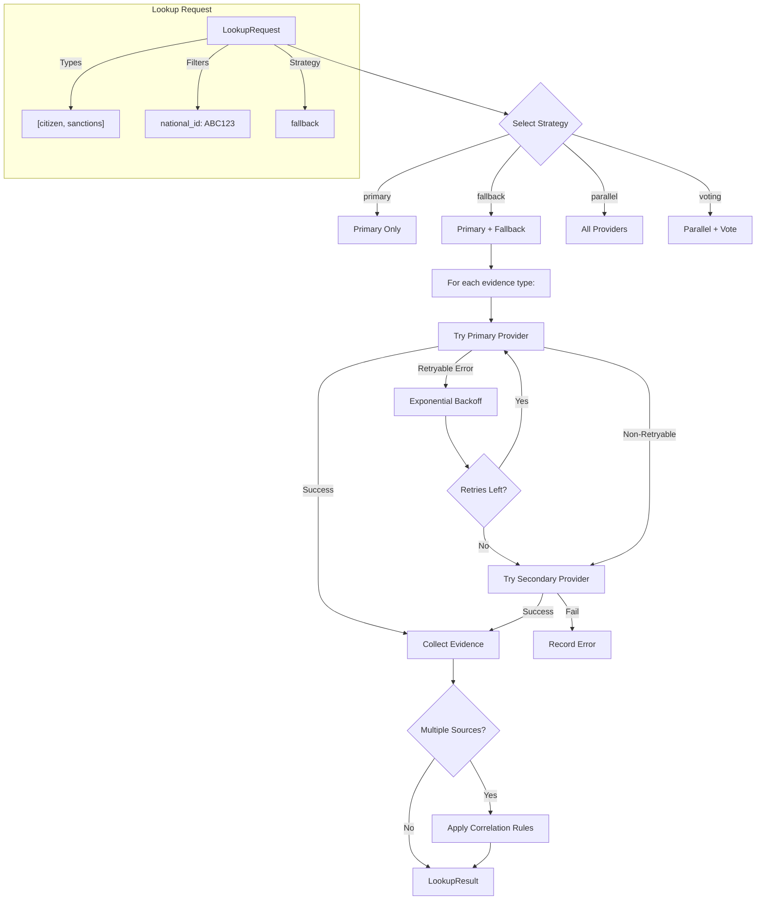
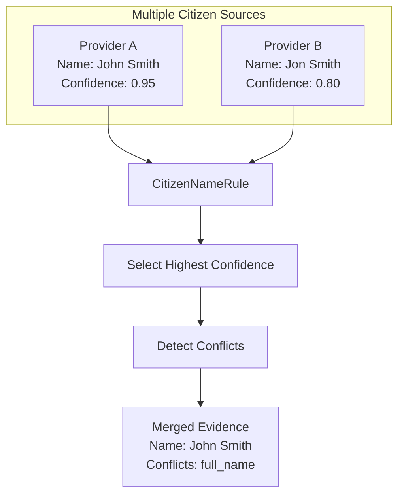
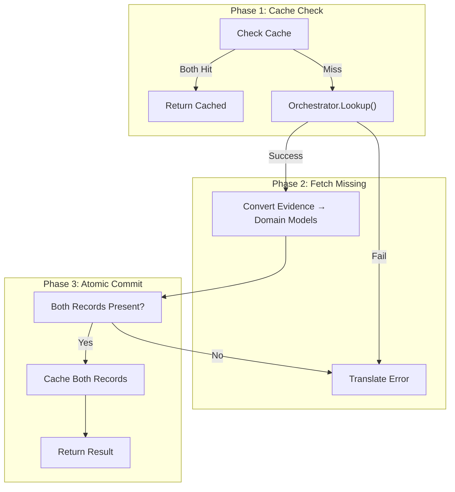
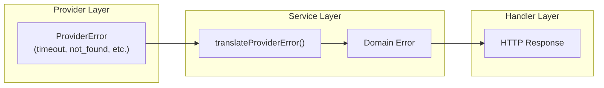
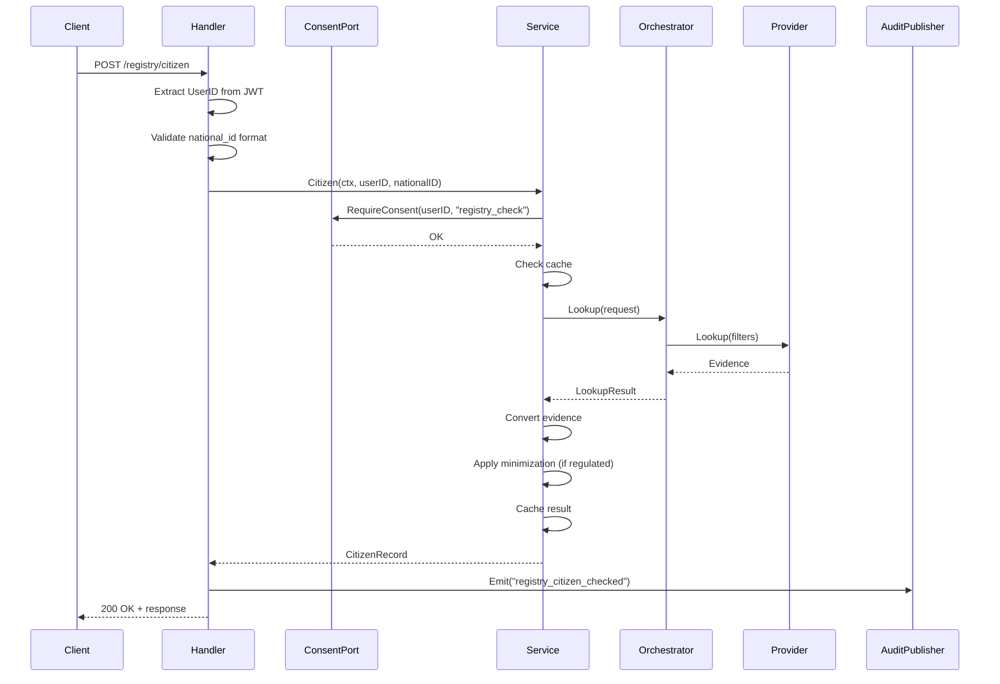

# Registry Module

Multi-source citizen and sanctions registry lookups with provider orchestration.

---

## Domain Design

### Bounded Context

**Context:** `internal/evidence/registry`

**Purpose:** Coordinate evidence gathering from external registry sources:
- Citizen registry lookups (identity validation)
- Sanctions list checks (compliance screening)
- Multi-provider orchestration with fallback and caching
- PII minimization in regulated mode

This is a distinct bounded context because registry lookups have their own provider abstraction, error taxonomy, caching semantics, and evidence correlation rules separate from consent, auth, or decision contexts.

### Subdomain Structure

The Registry bounded context is organized into two first-class **subdomains** with a **shared kernel**:

```
domain/
├── shared/              # Shared Kernel - common domain primitives
│   └── types.go         # Confidence, CheckedAt, ProviderID
├── citizen/             # Citizen Subdomain - identity verification
│   └── citizen.go       # CitizenVerification aggregate root
└── sanctions/           # Sanctions Subdomain - compliance screening
    └── sanctions.go     # SanctionsCheck aggregate root
```

#### Shared Kernel (`domain/shared/`)

Domain primitives shared between Citizen and Sanctions subdomains:

| Type | Description | Invariants |
|------|-------------|------------|
| `NationalID` | Validated lookup key (defined in `pkg/domain`) | 6-20 alphanumeric (A-Z, 0-9) |
| `Confidence` | Evidence reliability score | 0.0-1.0 range |
| `CheckedAt` | Verification timestamp | TTL-aware freshness checks |
| `ProviderID` | Evidence source identifier | Non-empty |

#### Citizen Subdomain (`domain/citizen/`)

**Aggregate Root:** `CitizenVerification`

Handles identity verification through national population registries. Contains PII that requires GDPR compliance.

```go
type CitizenVerification struct {
    nationalID  id.NationalID
    details     PersonalDetails    // PII: name, DOB, address
    status      VerificationStatus // Valid flag + CheckedAt
    providerID  shared.ProviderID
    confidence  shared.Confidence
    minimized   bool
}

// Key method: GDPR-compliant minimization
func (c CitizenVerification) Minimized() CitizenVerification
```

**Key Invariants:**
- NationalID is always present and valid
- Minimized records have empty PersonalDetails
- Minimization is one-way (cannot "un-minimize")

#### Sanctions Subdomain (`domain/sanctions/`)

**Aggregate Root:** `SanctionsCheck`

Handles compliance screening against sanctions lists, PEP databases, and watchlists.

```go
type SanctionsCheck struct {
    nationalID  id.NationalID
    listed      bool
    details     ListingDetails     // Type, reason, date
    source      Source
    checkedAt   shared.CheckedAt
    providerID  shared.ProviderID
    confidence  shared.Confidence
}

// Rich query methods
func (s SanctionsCheck) IsSanctioned() bool
func (s SanctionsCheck) IsPEP() bool
func (s SanctionsCheck) IsOnWatchlist() bool
func (s SanctionsCheck) RequiresEnhancedDueDiligence() bool
```

**Key Invariants:**
- Source is always present
- If Listed is true, ListType must be set
- If Listed is false, ListingDetails is empty

### Domain Purity

All domain packages (`domain/*`) follow strict purity rules:

| Rule | Rationale |
|------|-----------|
| No I/O | Domain logic independent of infrastructure |
| No `context.Context` | Domain doesn't coordinate async/cancellation |
| No `time.Now()` | Time injected from application layer |
| Pure input → output | Fully testable without mocks |

### Ubiquitous Language

| Domain Term            | Code Location                                     |
| ---------------------- | ------------------------------------------------- |
| **CitizenVerification** | `domain/citizen.CitizenVerification` (aggregate) |
| **SanctionsCheck**     | `domain/sanctions.SanctionsCheck` (aggregate)    |
| **NationalID**         | `pkg/domain.NationalID` (value object)           |
| **Provider**           | `providers.Provider` (interface)                  |
| **Evidence**           | `providers.Evidence` (generic result from any provider) |
| **Citizen Record**     | `models.CitizenRecord` (infrastructure model)    |
| **Sanctions Record**   | `models.SanctionsRecord` (infrastructure model)  |
| **Orchestrator**       | `orchestrator.Orchestrator`                       |
| **Lookup Strategy**    | `orchestrator.LookupStrategy` (primary, fallback, parallel, voting) |
| **Provider Chain**     | `orchestrator.ProviderChain` (primary + fallbacks) |
| **Correlation Rule**   | `orchestrator.CorrelationRule` (evidence merging) |
| **Provider Error**     | `providers.ProviderError` (normalized failure)    |

---

## Architecture

This module follows **hexagonal architecture** with an **orchestrator pattern** for multi-provider coordination:

```
                           ┌────────────────────────────────────────────────────┐
                           │                   Transport                        │
                           │  HTTP handlers (internal/evidence/registry/handler)│
                           │  - POST /registry/citizen                          │
                           └──────────────────────────┬─────────────────────────┘
                                                      │
                                                      ▼
                           ┌────────────────────────────────────────────────────┐
                           │                Domain (Service)                    │
                           │  registry.Service                                  │
                           │  - Check(ctx, userID, nationalID) → RegistryResult │
                           │  - Citizen(ctx, userID, nationalID) → CitizenRecord │
                           │  - Sanctions(ctx, userID, nationalID) → SanctionsRecord │
                           └──────────────────────────┬─────────────────────────┘
                                                      │
                      ┌───────────────────────────────┼───────────────────────────┐
                      │                               │                           │
                      ▼                               ▼                           ▼
           ┌──────────────────────┐     ┌─────────────────────────┐   ┌──────────────────────┐
           │ Cache Store          │     │ Orchestrator            │   │ Ports                │
           │ - FindCitizen()      │     │ - Lookup(request)       │   │ - ConsentPort        │
           │ - SaveCitizen()      │     │ - Strategy selection    │   │ - AuditPublisher     │
           │ - FindSanction()     │     │ - Error aggregation     │   │   (service/handler)  │
           │ - SaveSanction()     │     │ - Backoff/retry         │   │                      │
           └──────────────────────┘     └───────────┬─────────────┘   └──────────────────────┘
                                                    │
                                    ┌───────────────┼───────────────┐
                                    ▼               ▼               ▼
                          ┌──────────────┐  ┌──────────────┐  ┌──────────────┐
                          │ Citizen      │  │ Sanctions    │  │ Future       │
                          │ Provider     │  │ Provider     │  │ Providers    │
                          │ (HTTP)       │  │ (HTTP)       │  │ (gRPC, etc.) │
                          └──────────────┘  └──────────────┘  └──────────────┘
```

---

## Module Structure

```
internal/evidence/registry/
├── domain/             # Pure domain layer (no I/O)
│   ├── shared/         # Shared kernel (Confidence, CheckedAt, ProviderID)
│   ├── citizen/        # Citizen subdomain aggregate
│   └── sanctions/      # Sanctions subdomain aggregate
├── adapters/           # Inbound adapters for external dependencies
│   └── consent_adapter.go
├── handler/            # HTTP handlers (decode, validate, respond)
├── metrics/            # Registry cache metrics
├── models/             # Infrastructure entities (for persistence/transport)
├── orchestrator/       # Multi-provider coordination
│   └── correlation/    # Evidence correlation rules
├── ports/              # Interface definitions
├── providers/          # Provider abstraction and implementations
│   ├── adapters/       # HTTP client adapters
│   ├── citizen/        # Citizen registry provider
│   ├── providertest/   # Provider contract helpers
│   └── sanctions/      # Sanctions list provider
├── service/            # Application service (orchestration + effects)
└── store/              # Persistence adapters
```

---

## Orchestrator Pattern

The orchestrator is the core pattern that differentiates this module from simpler service layers. It manages multi-source evidence gathering with configurable strategies.

### Orchestrator Flow



### Lookup Strategies

| Strategy     | Behavior                                              | Use Case                        |
| ------------ | ----------------------------------------------------- | ------------------------------- |
| **primary**  | Only use primary provider                             | Simple, single-source lookups   |
| **fallback** | Try primary, then secondaries on failure              | High availability (default)     |
| **parallel** | Query all providers simultaneously                    | Speed-critical, multi-source    |
| **voting**   | Parallel + select highest confidence                  | Conflict resolution             |

### Backoff and Retry

For retryable errors (timeout, rate limit, outage), the orchestrator applies exponential backoff:

Default configuration:
- Initial delay: 100ms
- Max delay: 2s
- Max retries: 3
- Multiplier: 2.0

---

## Provider Abstraction

Providers implement a unified interface for evidence sources:

```go
type Provider interface {
    ID() string
    Capabilities() Capabilities
    Lookup(ctx context.Context, filters map[string]string) (*Evidence, error)
    Health(ctx context.Context) error
}
```

Note: Only the HTTP adapter is implemented today; SOAP/gRPC adapters are planned.

### Supported Provider Types

| Type         | Description                    | Current Implementations         |
| ------------ | ------------------------------ | ------------------------------- |
| `citizen`    | Identity/citizen registries    | `citizen.Provider` (HTTP)       |
| `sanctions`  | Sanctions/watchlist checks     | `sanctions.Provider` (HTTP)     |
| `biometric`  | Biometric verification         | (planned)                       |
| `document`   | Document verification          | (planned)                       |
| `wallet`     | Digital ID wallet integration  | (planned)                       |

### Evidence Structure

```go
type Evidence struct {
    ProviderID   string                 // Which provider produced this
    ProviderType ProviderType           // citizen, sanctions, etc.
    Confidence   float64                // 0.0-1.0 confidence score
    Data         map[string]interface{} // Provider-specific structured data
    CheckedAt    time.Time
    Metadata     map[string]string      // Trace IDs, etc.
}
```

---

## Correlation Rules

When gathering evidence from multiple sources, correlation rules reconcile conflicts:

### CitizenNameRule

Merges citizen evidence when multiple sources return conflicting names:



### WeightedAverageRule

Combines confidence scores using configurable weights per provider type.

---

## Service Layer

The service coordinates orchestrator lookups with caching and optional minimization:

Implementation notes:
- Regulated mode strips PII and national_id before caching/returning citizen records.
- Check() uses the fallback strategy and performs per-type lookups sequentially (parallel fan-out is pending).
- Sanctions checks emit fail-closed audits in the service layer.

### Check() - Atomic Transaction Semantics



**Key invariant:** Both citizen and sanctions lookups must succeed before either result is cached. This prevents partial state on retry.

---

## Error Handling

### Provider Error Taxonomy

```go
type ErrorCategory string

const (
    ErrorTimeout          = "timeout"           // Retryable
    ErrorBadData          = "bad_data"          // Non-retryable
    ErrorAuthentication   = "authentication"    // Non-retryable
    ErrorProviderOutage   = "provider_outage"   // Retryable
    ErrorContractMismatch = "contract_mismatch" // Non-retryable
    ErrorNotFound         = "not_found"         // Non-retryable
    ErrorRateLimited      = "rate_limited"      // Retryable
    ErrorInternal         = "internal"          // Non-retryable
)
```

### Error Translation



| Provider Error       | Domain Error      | HTTP Status |
| -------------------- | ----------------- | ----------- |
| `timeout`            | `CodeTimeout`     | 504         |
| `not_found`          | `CodeNotFound`    | 404         |
| `rate_limited`       | `CodeInternal`    | 500         |
| `provider_outage`    | `CodeInternal`    | 500         |
| `bad_data`           | `CodeBadRequest`  | 400         |

---

## Regulated Mode (PII Minimization)

When `REGULATED_MODE=true`, the service minimizes citizen records via the domain aggregate:

```go
func (c CitizenVerification) Minimized() CitizenVerification
func (c CitizenVerification) WithoutNationalID() CitizenVerification
```

The service uses `WithoutNationalID()` before caching/returning, so PII and the lookup key are removed while validity and timestamps are preserved.

---

## Domain Models

### CitizenRecord

```go
type CitizenRecord struct {
    NationalID  string    // Stripped in regulated mode
    FullName    string    // Stripped in regulated mode
    DateOfBirth string    // Stripped in regulated mode
    Address     string    // Stripped in regulated mode
    Valid       bool      // Identity validation result
    Source      string    // Provider identifier
    CheckedAt   time.Time
}
```

### SanctionsRecord

```go
type SanctionsRecord struct {
    NationalID string
    Listed     bool      // On sanctions list
    Source     string    // Which list (OFAC, EU, etc.)
    CheckedAt  time.Time
}
```

### RegistryResult

```go
type RegistryResult struct {
    Citizen  *CitizenRecord
    Sanction *SanctionsRecord
}
```

---

## HTTP Endpoints

- `POST /registry/citizen` - Citizen lookup (requires `registry_check` consent)

### Request Flow



---

## Ports (Interfaces)

### ConsentPort

```go
type ConsentPort interface {
    RequireConsent(ctx context.Context, userID string, purpose string) error
}
```

### AuditPublisher

```go
type AuditPublisher interface {
    Emit(ctx context.Context, event audit.Event) error
}
```

---

## Audit Events

| Transition               | Audit Action                 |
| ------------------------ | ---------------------------- |
| Citizen lookup complete  | `registry_citizen_checked`   |
| Sanctions check complete | `registry_sanctions_checked` |

---

## Security Considerations

### Provider Response Validation

All provider responses are validated with fail-fast semantics:

- **Required field extraction** uses `getRequiredString()`/`getRequiredBool()` which return errors on missing or wrong-typed fields (no silent defaults)
- **Domain error codes** wrap all validation errors for consistent error handling
- This prevents silent failures that could create invalid domain state

### Response Size Limiting

HTTP provider adapters enforce a maximum response size (10MB) using `io.LimitReader`:

```go
limitedReader := io.LimitReader(resp.Body, MaxResponseSize+1)
body, err := io.ReadAll(limitedReader)
if int64(len(body)) > MaxResponseSize {
    return providers.NewProviderError(providers.ErrorBadData, ...)
}
```

This prevents memory exhaustion attacks from malicious or misconfigured providers.

### Fail-Closed Audit Semantics

Sanctions checks use **fail-closed** audit semantics:

- Audit MUST succeed for both listed and non-listed sanctions results
- If audit emission fails, the lookup returns an error (blocks response)
- This ensures complete audit trail for compliance purposes
- Rationale: Sanctions screening is security-critical; an incomplete audit trail is unacceptable

```go
// service/service.go
if err := s.auditor.Emit(ctx, event); err != nil {
    return dErrors.New(dErrors.CodeInternal, "unable to complete sanctions check")
}
```

---

## Known Gaps / Follow-ups

- Biometric, document, and wallet providers planned
- Full voting strategy with quorum rules not implemented
- Provider health checks not wired to readiness probes

---

## Testing

| Layer                   | Location                                        | Purpose                              |
| ----------------------- | ----------------------------------------------- | ------------------------------------ |
| Primary (Gherkin)       | `e2e/features/registry_*.feature`               | Published behavior contracts         |
| Secondary (Unit)        | `orchestrator/orchestrator_test.go`             | Strategy selection, backoff          |
| Tertiary (Unit)         | `service/service_test.go`, `providers/*_test.go`| Error propagation, evidence parsing  |

---

## Configuration

| Env Variable              | Default                     | Description                                      |
| ------------------------- | --------------------------- | ------------------------------------------------ |
| `CITIZEN_REGISTRY_URL`    | `http://localhost:8082`     | Base URL prefix for providers (adapter appends `/lookup`) |
| `CITIZEN_REGISTRY_API_KEY`| `citizen-registry-secret-key` | API key for registry providers                   |
| `REGISTRY_TIMEOUT`        | `5s`                        | Per-request timeout for registry providers       |
| `REGISTRY_CACHE_TTL`      | `5m`                        | Cache TTL for registry lookups                   |
| `REGULATED_MODE`          | `false`                     | Strip PII and national_id from citizen records   |

Notes:
- Sanctions provider currently uses the same URL and API key config as the citizen provider.
- The HTTP adapter posts to `{baseURL}/lookup`; mock registry base URLs should include the path prefix (e.g., `.../api/v1/citizen`).

### Orchestrator Defaults

| Setting         | Default | Description                            |
| --------------- | ------- | -------------------------------------- |
| DefaultTimeout  | 5s      | Per-lookup timeout                     |
| DefaultStrategy | fallback| Lookup strategy                        |
| InitialDelay    | 100ms   | Backoff initial delay                  |
| MaxDelay        | 2s      | Backoff max delay                      |
| MaxRetries      | 3       | Number of retry attempts               |
| Multiplier      | 2.0     | Backoff multiplier                     |

---

## References

- Architecture: `docs/engineering/architecture.md`
- GDPR Data Minimization: `docs/security/REGULATED_MODE.md`
